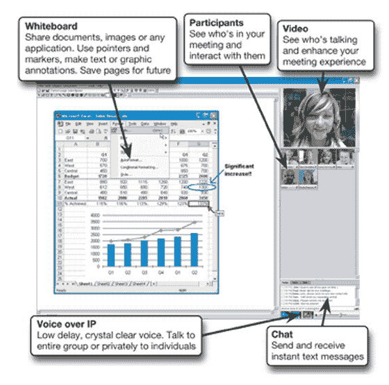

# 谷歌收购 Marratech 进入 WebEx 领域 TechCrunch

> 原文：<https://web.archive.org/web/http://www.techcrunch.com:80/2007/04/20/google-acquires-marratech-gets-into-webex-territory/#comment-1339277>

# 谷歌收购 Marratech 进入 WebEx 的领域

在报告了一个[庞然大物](https://web.archive.org/web/20220928194316/http://biz.yahoo.com/bw/070419/20070419006102.html)的财政季度(该公司目前拥有近 120 亿美元的现金，今年雇佣了近 2000 名新员工)后，谷歌今晚在其公司博客上悄悄宣布——他们已经收购了瑞典初创公司 [Marratech](https://web.archive.org/web/20220928194316/http://www.marratech.com/) ，价格未披露。

这是我第一次听说 Marratech，它广泛存在于电子会议领域，肯定会与 WebEx 竞争(最近[被思科](https://web.archive.org/web/20220928194316/http://www.beta.techcrunch.com/2007/03/15/cisco-buys-webex-for-32-billion/)以 32 亿美元收购)。用户能够通过文本聊天、VOIP 和视频进行交流，并在虚拟会议中共享应用程序。

他们的服务需要下载，而大多数新发布的电子会议解决方案都是基于浏览器的(因此功能较少)。软件的 Windows 版本为 31mb；Mac 版本只有 9 MB。谷歌已经在许多电脑上安装了 GTalk、桌面和工具栏应用软件。将这些捆绑在一起并非不可想象。

谷歌的企业雄心又向前迈进了一步。