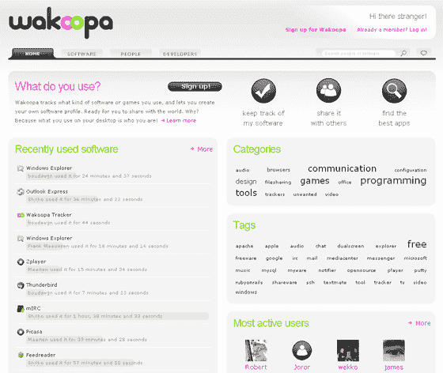

# wakoopa:last . FM For Desktop Applications TechCrunch

> 原文：<https://web.archive.org/web/http://www.techcrunch.com:80/2007/04/27/wakoopa-lastfm-for-desktop-applications/#comment-1353697>

# Wakoopa: Last.fm 用于桌面应用程序

 [Last.fm](https://web.archive.org/web/20230203091900/https://techcrunch.com/2006/11/01/lastfm-relaunches-with-new-features/) 为音乐所做的正是荷兰初创公司 [Wakoopa](https://web.archive.org/web/20230203091900/http://wakoopa.com/) 想为你的桌面应用所做的。像 Last.fm 一样，Wakoopa 使用下载的跟踪器，只是它会跟踪你使用应用程序而不是听音乐的频率。同样，Wakoopa 还围绕这些数据建立了一个基于 Rails 的社交网站，让用户与朋友分享他们的偏好，撰写他们最喜欢的应用程序的评论，并下载新的应用程序。Wakoopa 由荷兰三大媒体公司(Ilse，IDG，Telegraaf)的基金支持，将于 5 月 2 日推出。

Wakoopa 的追踪器会记录你使用的应用程序和使用时间，每 15 分钟更新一次你的个人资料。在网站上，汇总数据列出了最近使用的应用程序和有史以来使用最多的应用程序。每个应用程序都有一个配置文件，其中列出了使用它的人和组、评论和标签。对于免费应用程序，它还包括各种版本的下载链接，可能会创建一个更加社会化的 SourceForge。对于私人测试版，Firefox 是最常用的应用程序，有 23 人使用超过 117 小时。MSN messenger 是一个奇怪的第二名，总共记录了 14 个小时。

由于对桌面应用程序的狂热没有音乐那样的大众市场吸引力，我看不出它会突破开发者社区，除非跟踪器与一些真正有吸引力的免费赠品捆绑在一起。
