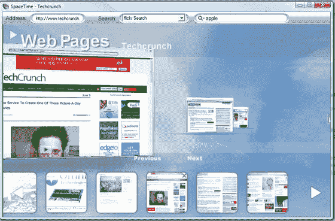
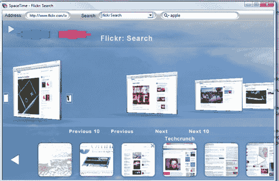

# 时空:3D 浏览器视觉盛宴 TechCrunch

> 原文：<https://web.archive.org/web/http://www.techcrunch.com:80/2007/06/05/spacetime-3d-browser-eye-candy/#comment-1411673>

# 时空:3D 浏览器视觉糖果

 总部位于纽约的 [SpaceTime](https://web.archive.org/web/20221001092148/http://www.spacetime.com/) 发布了 SpaceTime 3D，这是一款真正带标签浏览 3D 的网络浏览器。

SpaceTime 允许用户在一个可视化的时间线中绘制出他们的浏览进度，将每个网站视为一个可以在 3D 环境中操纵和重新排列的对象。用户可以根据需要在 3D 和 2D 视角之间切换。

SpaceTime 的搜索功能将多个搜索结果加载为一堆独立的页面，一次同时加载 10 个结果，每个结果都有自己的窗口。用户可以翻阅结果，重新安排页面或操纵它们。时空搜索目前支持谷歌，谷歌图像，雅虎！，雅虎！图片，Flickr，易贝和其他。

很难描述用户体验。这是纯粹的赏心悦目，有点像第二人生遇到火狐。作为一个独立的浏览器，SpaceTime 3D 缺少你对浏览器的大部分期望。没有书签支持，除了 3D 渲染和搜索之外，真的什么都没有。我看不到人们抛弃他们的传统浏览器去拥抱这个；然而，成功的障碍不是来自数百万用户，而是来自足够多的用户，他们看到通过搜索联盟费与谷歌和其他公司直接交易的回报，这与 Flock 和 Firefox 使用的模式相同。

 