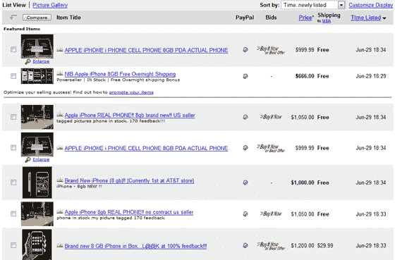

# 伊卡萨丁:iPhones 充斥易贝

> 原文：<https://web.archive.org/web/http://www.techcrunch.com:80/2007/06/29/icashedin-iphones-flood-ebay/#comment-1474308>

这一点也不奇怪:iPhone 买家正带着他们的新 iPhone 涌入易贝，起价从 1 美元到高达 1500 美元的一口价。

对于那些在美国以外迫切想要得到 iPhone 的人来说，许多列表提供全球送货服务；[这个清单](https://web.archive.org/web/20150807004923/http://cgi.ebay.com/BRAND-NEW-8GB-IPHONE-WITH-RECIEPT-SHIPS-MONDAY_W0QQitemZ200124547738QQihZ010QQcategoryZ64355QQrdZ1QQcmdZViewItem)以 50 美元的价格发布到澳大利亚为例。然而，请注意，iPhone 不支持 simcards，今天没有人知道如何从 AT & T 解锁手机，尽管你可以现在购买，以后再解决这个问题(或者将 iPhone 用作昂贵的视频 iPod)。MacNN [有 iPhone 内部的截图](https://web.archive.org/web/20150807004923/http://www.macnn.com/articles/07/06/29/first.iphone.disassembly/)给那些有兴趣破解它的人。

如果你真的报名参加了美国电话电报公司计划，并且住在美国以外的地方，请注意美国电话电报公司的国际漫游费率会让喝醉的水手脸红。

