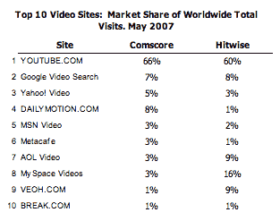

# 每个人都在瞄准 YouTube——TechCrunch

> 原文：<https://web.archive.org/web/http://www.techcrunch.com:80/2007/06/30/everyones-gunning-for-youtube/#comment-1474715>

 对 IPTV 的关注和实验正在从在 [YouTube](https://web.archive.org/web/20211023042308/http://www.crunchbase.com/company/youtube) 上观看短片转向在可下载的电视应用程序上观看完整长度的节目，如 [Joost](https://web.archive.org/web/20211023042308/http://www.crunchbase.com/company/joost) 、 [Babelgum](https://web.archive.org/web/20211023042308/http://www.crunchbase.com/company/babelgum) 、 [Veoh TV](https://web.archive.org/web/20211023042308/http://www.beta.techcrunch.com/2007/06/20/veoh-announces-veohtv-a-sort-of-distributed-joost/) 、[网飞](https://web.archive.org/web/20211023042308/http://www.beta.techcrunch.com/2007/01/16/netflix-i-was-just-kidding-about-breaking-up-with-you/)(现在有了一个 [Silverlight](https://web.archive.org/web/20211023042308/http://www.beta.techcrunch.com/2007/05/01/take-time-to-understand-silverlight-its-important/) 应用程序)和其他应用程序。YouTube 继续增长，但人们并不希望在那里找到完整长度的电视节目。

不过，这并没有阻止竞争对手试图从中分一杯羹。

YouTube 有许多直接的竞争对手，但网络效应很久以前就对 YouTube 产生了影响，宽松的版权政策或更高质量的视频不太可能对它们的市场份额产生任何影响。但是电视网仍然在盯着 YouTube 的 16.5 亿美元的价格，他们想要他们的那一磅肉。

**竞争对手在兜圈子**

 Hitwise 本周早些时候公布的一些统计数据显示，YouTube 在美国视频分享网站中占有 60%的市场份额——它们的访问量超过了所有竞争对手的总和。即使在电视网开始对他们进行大规模诉讼后，他们仍继续快速增长。

康姆斯克全球数据几乎相同，显示 YouTube 拥有 66%的市场份额。并列数字见左边的图表。

很明显，市场可能足够大，足以让一些竞争对手获得成功，但没有人会很快将 YouTube 淘汰出局。

**小丑公司还在胡闹**

 三月份，我们见证了一项新服务的戏剧性推出，它得到了新闻集团(MySpace 的所有者)和 NBC 的支持。他们称之为“NBC 环球和新闻集团的在线视频合资企业”，这并不太吸引人。当[开始有传言称](https://web.archive.org/web/20211023042308/http://www.beta.techcrunch.com/2007/03/23/what-we-know-so-far-about-newtube-isnt-good/)谷歌高管称其为“小丑公司”时，这个名字就流传了下来。在他们给这个东西命名之前，真的没有别的东西可以指它。

虽然没有名字，但这并没有阻止他们采取一些大胆的措施。本周，他们任命哈佛 MBA、亚马逊前高管杰森·基拉尔(Jason Kilar)领导该部门。现在有[报道](https://web.archive.org/web/20211023042308/http://newteevee.com/2007/06/27/newco-thinks-its-worth-a-billion-dollars/)称他们正试图以 10 亿美元的估值筹集 1 亿美元的风险资本。YouTube [筹集的资金](https://web.archive.org/web/20211023042308/http://www.crunchbase.com/company/youtube)只是其中的一小部分。

公平地说，小丑公司不应该是 YouTube 的直接竞争对手，它承诺了一种更加分布式的方法。他们将拥有(合法获得的)来自 NBC 和新闻集团的内容，这是相对于竞争对手的一大优势。一旦它发射，我们将不得不拭目以待。但是命名问题，以及母公司在媒体电话中称其为“地球上最大的广告平台”的事实，表明它有一个非常糟糕的开端。

新闻集团再下赌注
  拥有 MySpace 的新闻集团正在小丑公司之外再下赌注。本周他们宣布推出 [MySpace TV](https://web.archive.org/web/20211023042308/http://www.beta.techcrunch.com/2007/06/27/myspace-vidoes-to-become-myspace-tv-youtube-competitor/) ，这是 YouTube 的直接竞争对手。MySpace 已经从用户那里收集视频剪辑一年多了，他们最近以3 亿美元收购 [Photobucket](https://web.archive.org/web/20211023042308/http://www.crunchbase.com/company/photobucket) 为这个库增加了更多内容。

拥有 MySpace TV 背后的 MySpace 资产是一个巨大的竞争优势，尽管谷歌的搜索引擎在 YouTube 后面，这不仅仅是公平的竞争环境。由于 MySpace 已经表现出了屏蔽第三方视频的意愿，即使有一点广告的迹象，随着时间的推移，YouTube 可能会发现它在这方面无能为力。

因此，MySpace TV 是 YouTube 最大的直接威胁。但在我看来，即使从长远来看，这也不足以将他们从榜首位置上赶下来。YouTube 现在在主流用户心目中已经根深蒂固，他们可以在这个网站上看到用户制作的视频和受版权保护的视频剪辑，而且他们得到了谷歌的支持。没人能在短时间内夺走他们的权利。