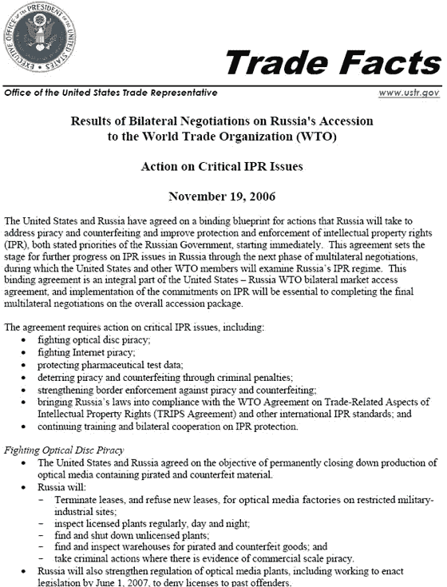
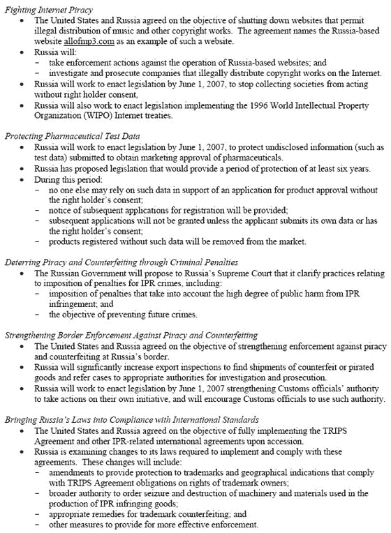

# 俄国同意美国关闭 AllofMP3.com 的要求

> 原文：<https://web.archive.org/web/http://www.techcrunch.com:80/2007/05/03/breaking-yahoo-to-announce-closure-of-yahoo-photos-tomorrow/%3C>

今天，一份官方文件发布在 [Digg](https://web.archive.org/web/20081204111536/http://digg.com/tech_news/Allofmp3_to_be_closed) 上，概述了美国和俄罗斯之间的一项协议，俄罗斯同意关闭[AllofMP3.com](https://web.archive.org/web/20081204111536/http://www.techcrunch.com/tag/AllofMP3/)，以及任何“允许非法传播音乐和其他版权作品”的网站

协议日期是 11 月 19 日，发布在美国贸易代表办公室的网站上。它总结了两国打击内容盗版的共同努力，众所周知，这个问题集中在俄罗斯和东欧。

该文件称:“这一协议为俄罗斯在知识产权问题上通过下一阶段的多边谈判取得进一步进展奠定了基础，在此期间，美国和其他世贸组织成员将审查俄罗斯的知识产权制度。”。

这份文件特别提到了 AllofMP3.com，作为他们将要关闭的网站类型的一个例子。我们联系了 AllofMP3.com，该公司给我们发来了一份官方声明，说明其合法性。据称，该公司已应版权所有者的要求，主动提出移除非法音乐。

“几个月来，AllofMP3 一直表示，公司将遵从任何版权所有者的要求，从网站上删除任何音乐。然而，该公司没有收到俄罗斯授权协会或唱片公司的消息。也许，选择退出的请求没有被提出，因为唱片公司不能清除权利。”

尽管如此，该公司正在成为一个有目共睹的榜样。俄罗斯被指示终止为在线盗版提供便利的公司的租约，定期检查工厂，并在有证据表明商业销售盗版的情况下采取刑事行动。预计政府将于 2007 年 6 月 1 日开始执行。

