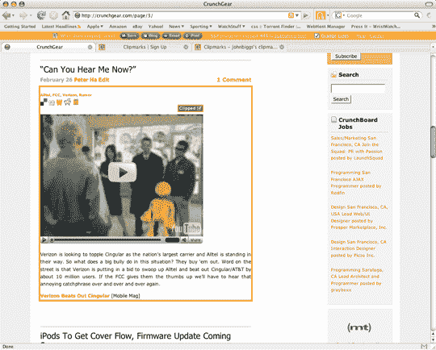
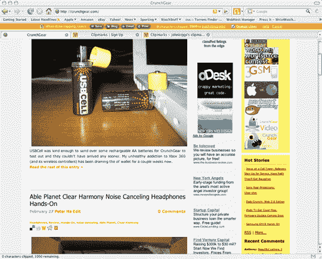
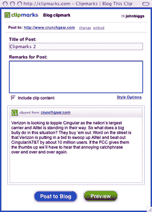

# Techcrunch

> 原文：<https://web.archive.org/web/http://www.techcrunch.com:80/2006/05/16/aol-to-release-youtube-clone/&dll=dtportal>

### 迈克尔·阿灵顿

 今天晚些时候，音乐社交网络 [iLike](https://web.archive.org/web/20070228112645/http://www.ilike.com/) 将报告称，自[推出](https://web.archive.org/web/20070228112645/http://www.techcrunch.com/2006/10/24/ilike-brings-free-indy-music-to-itunes-recommendations/)以来的前四个月，他们的注册用户已经达到 50 万。不会透露的是，但我从内部人士那里听说，每天大约有 20，000 名新用户加入。

该公司将与 MOG 一起出席明天在纽约举行的数字音乐论坛东方会议。这两家公司合在一起是美国对 Last.fm 病毒机器的最好回答，该机器每月有 1500 万独立访客，并主导着社交音乐空间。Last.fm 总部位于伦敦。

这三家公司(iLike、MOG 和 Last.fm)的支柱是收集用户收听习惯的元数据——这三家公司都有监控用户收听内容的软件——然后将这些数据整合到各自的社交网络中。当我上周在伦敦会见 Last.fm 高管团队时，他们告诉我，迄今为止，他们已经收集了超过 5 亿条用户数据，他们称之为“scrob bel”(他们每秒钟收集大约 175 个新的 scrob bel*)。Last.fm 是基于音乐的社交网络的 MySpace。*

*[Sphere It](https://web.archive.org/web/20070228112645/http://www.sphere.com/search?q=sphereit:http://www.techcrunch.com/2007/02/27/ilike-growing-quickly-still-massively-trailing-lastfm/ "Related Blogs & Articles")* *张贴在[公司&产品简介](https://web.archive.org/web/20070228112645/http://www.techcrunch.com/category/company-product-profiles/ "View all posts in Company & Product Profiles") |*  *### 尼克·冈萨雷斯

 在自行开发产品六个月后，总部位于纽约的 [Outside.in](https://web.archive.org/web/20070228112645/http://outside.in/) 获得了来自天使投资人和三家风险投资公司的[融资](https://web.archive.org/web/20070228112645/http://outside.in/blog/2007/02/27/new-features-and-financing-press-release/):联合广场风险投资、里程碑风险投资伙伴和乡村风险投资。Union Square Ventures 的弗雷德·威尔逊在这里讨论融资问题。

Outside.in 的目标是将本地博客(placebloggers)的帖子整合到一个带标签的可搜索目录中。根据 Fred Wilson 的说法，他们希望为博客做些什么，就像 Google 本地搜索为网络所做的一样。像 [Yelp](https://web.archive.org/web/20070228112645/http://www.techcrunch.com/2006/10/04/yelp-secures-10-million-more-for-local-reviews/) 、 [InsiderPages](https://web.archive.org/web/20070228112645/http://www.techcrunch.com/2007/02/22/insider-pages-acquisition-may-be-announced-next-week/) 和 [Smalltown](https://web.archive.org/web/20070228112645/http://www.techcrunch.com/2006/10/10/smalltowncom-small-town-reviews-in-flash/) 这样的网站也在建立本地社区，但基于评论，讨论和博客发挥辅助作用。目录运行的一个例子:加利福尼亚州帕洛阿尔托的[最新博客文章](https://web.archive.org/web/20070228112645/http://outside.in/palo_alto)。通过向用户呈现帖子编码位置的地图，以及该区域具有类似标签的其他博客，每个帖子都被赋予了上下文。

一个博客的全部内容通过用户提交被添加到一个本地博客中，但是并不是所有的博客都只写他们本地的城镇。对于偶尔写一个地区的博客，Outside.in 有一个 bookmarklet 供用户建议个人故事，还有一个“Feedburner flare”选项，可以在你的帖子底部添加“geotag this”选项。

[Sphere It](https://web.archive.org/web/20070228112645/http://www.sphere.com/search?q=sphereit:http://www.techcrunch.com/2007/02/27/outsidein-gets-cash-for-geocoding-the-blogosphere/ "Related Blogs & Articles")

张贴在[公司&产品简介](https://web.archive.org/web/20070228112645/http://www.techcrunch.com/category/company-product-profiles/ "View all posts in Company & Product Profiles") |

### 瑞安·斯图尔特

我和其他一些博客作者一起参加了 Adobe Engage 活动，包括[大卫·柏林德](https://web.archive.org/web/20070228112645/http://blogs.zdnet.com/Berlind/?p=361)、[蒂姆·奥赖利](https://web.archive.org/web/20070228112645/http://radar.oreilly.com/archives/2007/02/creating_engagi.html)、 [罗伯特·斯考伯](https://web.archive.org/web/20070228112645/http://scobleizer.com/2007/02/27/drinking-the-adobe-coffee/) 和 [詹姆斯·州长](https://web.archive.org/web/20070228112645/http://www.redmonk.com/jgovernor/2007/02/27/adobe-engage-fighting-agai<br%20/>nst-the-architecture-of-the-space/)。我们从 Adobe 客户那里获得了演示(在某些情况下，还有该公司正在开发的产品)，我在我的 ZDNet 博客[通用桌面](https://web.archive.org/web/20070228112645/http://blogs.zdnet.com/Stewart/)上对此进行了报道。到目前为止，最大的亮点是 Adobe 高级副总裁兼首席软件架构师凯文·林奇关于阿波罗的主题演讲(你可以在这里收听最近对凯文·林奇、史蒂夫·吉尔默和迈克尔·阿灵顿的播客采访)。

房间里有很多好奇的博主，这意味着凯文在演讲时会提出很多好问题。Kevin 谈到 Adobe 参与平台已经拥有 7 亿台个人电脑和 2 亿台设备。在描述阿波罗在生态系统中的地位时，他展示了一张幻灯片，展示了丰富的资源和影响范围。到目前为止，Adobe 一直专注于跨平台的基于网络的体验，但通过 Apollo，他们希望进入更丰富的桌面体验以及更丰富的移动集成。

关于 Apollo 的许多基本信息已经被广泛报道，包括 TechCrunch，所以我将重点关注在博客中讨论最多的事情。安全性一直是社区中许多人关心的问题，对于这些观众来说似乎是次要的。有很多关于 Apollo 是否会被用于间谍软件或恶意软件的讨论，但归根结底，Adobe 认为用户对安装在他们机器上的东西拥有最终控制权。他们正在确保 Apollo 不能肆虐(它不能写入或删除系统文件夹，每个 Apollo 应用程序都是沙箱化的，因此 Apollo 应用程序不能从其他 Apollo 应用程序窃取数据)。

Apollo 的安装体验是通过 Flash Player 进行的，所以它绕过了微软的控制，这带来了更好的体验，也是 Adobe 控制的体验。Kevin 展示了安装单独的 Apollo 应用程序是多么快速和容易，这是一个非常好的用户体验。有一件事似乎让这里的人感到失望，那就是没有计划允许 Apollo 访问操作系统上的本地应用程序。Adobe 希望 Apollo 体验保持其跨平台的可移植性，他们的目标是在不开放特定于操作系统的可能性的情况下满足开发人员的需求。另一件越来越清晰的事情是 Apollo 应用程序将如何存储数据。Kevin 说，现在他们正在研究基于 XML 的存储，以及开发人员可以通过 API 绑定的高级文件系统缓存的可能性。开发者现在可以做到这一点，但他们正在谈论让它变得更容易。

这里有很多关于阿波罗的激动人心的事情。人们担心它的可行性以及人们将如何使用它。演讲者们一直在问的一个问题是“Apollo 如何帮助你”，主要答案似乎是文件系统访问。没有很多人打破界限。

[Sphere It](https://web.archive.org/web/20070228112645/http://www.sphere.com/search?q=sphereit:http://www.techcrunch.com/2007/02/27/talking-apollo-with-kevin-lynch-at-adobe-engage/ "Related Blogs & Articles")

张贴在[公司&产品简介](https://web.archive.org/web/20070228112645/http://www.techcrunch.com/category/company-product-profiles/ "View all posts in Company & Product Profiles") |

### 尼克·冈萨雷斯

 《第二人生》有过[音乐](https://web.archive.org/web/20070228112645/http://secondlife.com/community/music.php)，但除此之外一直相当沉寂。当林登实验室推出人与人之间的语音测试时，这一切很快就会改变。像许多其他游戏中的语音系统一样，你需要一个耳机，但第二人生将提供不同于魔兽世界对话宝石的点对点聊天体验。

新系统将模仿现实世界中的语音，根据说话者的距离和方向调整相对于你的声音音量。像其他产品一样，语音将只在某些数字地理区域活跃，但私人岛屿所有者将可以选择在自己的土地上启用语音，这取决于他们的订阅条款。多达 100 人将能够同时在同一连接上聊天。如果与每个人或任何人交谈太难，你可以跨越地理界限举行小组会议或一对一交谈。

整个系统由 [Vivox](https://web.archive.org/web/20070228112645/http://www.vivox.com/) 的语音聊天技术和 [DiamondWare](https://web.archive.org/web/20070228112645/http://www.diamondware.com/) 的 3D 语音技术之间的技术合作提供动力。最初的测试将面向 1000 名居民(通过给 3dvoice@lindenlab.com[发电子邮件来申请)，更大范围的测试将于 3 月份进行，正式的虚拟世界发布定于 2007 年在 Q2。](https://web.archive.org/web/20070228112645/mailto:3dvoice@lindenlab.com)

[Sphere It](https://web.archive.org/web/20070228112645/http://www.sphere.com/search?q=sphereit:http://www.techcrunch.com/2007/02/27/second-life-speaks/ "Related Blogs & Articles")

发布于[公司&产品简介](https://web.archive.org/web/20070228112645/http://www.techcrunch.com/category/company-product-profiles/ "View all posts in Company & Product Profiles") |

### 约翰·比格斯

[Clipmarks](https://web.archive.org/web/20070228112645/http://www.techcrunch.com/2006/10/24/the-new-mozilla-recommended-add-ons-list-the-winners-and-the-losers/)的纽约团队刚刚推出了他们产品的 2.0 版本，这是一个独特的网页剪辑系统，允许你从一个页面中截取你想要的段落、句子或多媒体，同时保持与原始文档的链接。

他们的首席执行官 Eric Goldstein 是一名律师，他厌倦了将引文剪切并粘贴到 Word 文件中，却发现 100 页的文件变得无法阅读和使用。他和他的团队推出了该产品的第一个版本，马歇尔几个月前就看过了，但最新版本的功能更加全面，也非常有趣。

该产品是一个 Mozilla/Firefox 或 IE 插件，可以调出交互式剪辑菜单。当你在文本上滚动时，Clipmarks 会高亮显示它，并允许你将其剪辑到电子邮件、博客(包括 Wordpress 和 Blogger 在内的许多 CMSes 都支持)中，以便打印或保存。这些剪辑存储在 Clipmarks 服务器上，可以“弹出”到首页与其他读者分享。

这些流行的故事允许投票，并且在主页上有一个流行故事的流水账。Goldstein 提到，没有办法投票反对一个故事，所以故事只能上升或消失，而不是被邪恶的流行游戏玩家降级。

社交方面仅次于获取文本片段、存储它们、甚至在博客帖子中使用它们的实际用途。有许多 Javascript 工具可以执行类似的任务，但是 Clipmarks 提供的格式选择和方法并不显眼，而且可能会让人上瘾。

在我使用它的短暂时间里，我能够抓取视频、单个句子，甚至整篇文章，并将它们拖到多个位置。在 Firefox 的菜单栏旁边有一个巨大的 Clipmarks 按钮，如果你不小心点击它，就会发现页面上的所有内容都出现了区块，这真的很烦人，但对于所提供的功能来说，这只是一个小小的代价。

[剪辑标记](https://web.archive.org/web/20070228112645/http://www.clipmarks.com/)

 没有标签 [Sphere It](https://web.archive.org/web/20070228112645/http://www.sphere.com/search?q=sphereit:http://www.techcrunch.com/2007/02/27/clipmarks-a-highlighter-for-the-web/ "Related Blogs & Articles")

张贴在[公司&产品简介](https://web.archive.org/web/20070228112645/http://www.techcrunch.com/category/company-product-profiles/ "View all posts in Company & Product Profiles") |

### 迈克尔·阿灵顿

<embed type="application/x-shockwave-flash" src="https://web.archive.org/web/20070228112645oe_/http://www.podtech.net/player/podtech-player.swf?bc=3F34K2L1" flashvars="content=http://media1.podtech.net/media/2007/02/PID_010362/Podtech_NING_demo.flv&amp;totalTime=751000&amp;">

如果你今天还没有花时间试用[新宁](https://web.archive.org/web/20070228112645/http://www.techcrunch.com/2007/02/26/ning-in-full/)，罗伯特·斯科博已经从首席执行官吉娜·比安奇尼那里拍摄了该产品的精彩演示(基本上与我昨天看到的演示相同)。其他博客也有大量的报道。

[Sphere It](https://web.archive.org/web/20070228112645/http://www.sphere.com/search?q=sphereit:http://www.techcrunch.com/2007/02/27/ning-demo-video/ "Related Blogs & Articles")

张贴在[公司&产品简介](https://web.archive.org/web/20070228112645/http://www.techcrunch.com/category/company-product-profiles/ "View all posts in Company & Product Profiles") |*