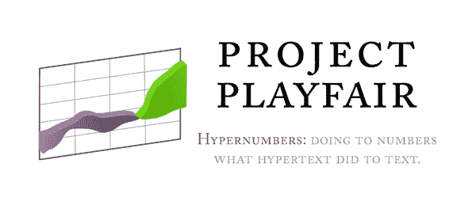

# 

> 原文：<https://web.archive.org/web/http://www.techcrunch.com:80/2006/11/03/brightroll-launches-diy-video-ad-network/&dll=mylinkbar>

面向欧洲初创公司的新型孵化器式活动[seed camp](https://web.archive.org/web/20070910010231/http://uk.techcrunch.com/2007/09/07/europes-seedcamp-winners-announced/)的获胜者已经公布。在一项非同寻常的决定中，36 名评委(由 Seedcamp 投资者组成，包括 9 名欧洲顶级风投、导师和 Seedcamp 董事会)决定为最初 20 家公司中的 6 家提供资金，而不是 5 家。他们是(排名不分先后):

**【项目集市】**

目前仍在开发中，来自英国苏格兰的 Playfair 项目是关于“超级数字”的。超文本对文本做了什么，他们想对数字做什么。这是一个大胆而迷人的想法，其中一个应用可能是协同电子表格工作，即每个单元格与其他地方保存的另一个电子表格中的另一个单元格进行对话。评委主席和 Seedcamp 创始人索尔·克莱恩说:“这支队伍从周一到周四日夜都在进步。这几乎是经典的种子投资。这是一个巨大的信念飞跃，但你必须鼓励那些想为数字做些什么的人，就像文本一样。是 Excel 2.0。这是一个极具技术含量的团队，他们解决了所在领域的棘手技术问题。”

**[泽曼塔](https://web.archive.org/web/20070910010231/http://www.zemanta.com/en/zaug/)**

泽曼塔(来自斯洛文尼亚)创建了一个“内容智能”平台来自动增强内容，使其可以上网。结果如何？粘贴一些文本，泽曼塔会查看，然后开始添加最可能的文本链接，然后你可以编辑(毫无疑问，许多博客作者会杀了它)。这种应用程序在学术和企业内容管理系统中大量存在，但至今还没有在 Web 上出现，因为这些往往是非常占用 CPU/资源的技术。这是一个 web 服务 API，在智能地查看内容并决定如何处理内容的能力方面与 Akismet 没有什么不同。索尔·克莱恩(Saul Klein)说:“我们热爱创始人，他们是充满激情的聪明人。他们甚至有了一个工作应用程序和一个客户(他们的总部在斯洛文尼亚的 albiet)。这对出版商来说是一个巨大的价值主张。又有多少博主会喜欢这个工具？我们还喜欢他们来自斯洛文尼亚(Seedcamp 在那里有很多申请)，Seedcamp 真的是要去欧洲的各个角落。”

(网站正在开发中，但它有一个工作应用程序)

Kublax 与您所有的银行账户、公用事业、甚至像航空里程这样的忠诚度计划同步，并以用户友好的格式呈现所有信息，以便您可以跟踪您的进出现金流，并开始真正分析您的个人财务状况。他们声称，所有的关键信息(登录等)都以高度加密的文件保存在桌面上。它还围绕你的个人财务创建了一个社交网络，其中关键信息不会被披露，但“人群”可以获得投资、储蓄账户、抵押贷款等方面的情报。索尔·克莱因说:“消费者主张是杀手。我希望只需点击一下鼠标，就能在一个地方看到我所有的消费信息，并直观地绘制成图表。在个人理财领域，我们还没有经历桌面出版革命。现在，个人理财不必是桌面应用程序，而是实时和网络化的。你甚至可以将自己的消费习惯与其他人进行对比。像 [Mint](https://web.archive.org/web/20070910010231/http://www.mint.com/) 这样的网站在美国有风险支持，但这项业务非常本地化，可以与当地市场整合。尽管有一个美国模式，但美国网站出现的时间并不长。这个团队在一无所有的情况下做了很多。再加上他们是[开咖](https://web.archive.org/web/20070910010231/http://www.opencoffeeclub.org/)校友，真正全力以赴进入创业空间。”

来自瑞典的 Tablefinders 的使命是聚合全球可在线预订的餐厅。这是一个餐厅营销平台，但不仅仅如此。通常餐馆使用两种全球预订系统之一，OpenTable 或 LiveBookings。Tablefinder 将聚合这些系统，让它们在一个公平的竞技场上竞争。付款从餐厅支付到其中一个系统，Tablefinder 是合作伙伴，因此将对餐厅预订收取未指定的佣金。迄今为止，融资一直是通过瑞典的一家小型风险投资公司进行的。我们的目标是与 LiveBookings 和 OpenTable 合作，所以期待很快会有一个公告。最终，餐馆可以像竞价 Google Adwords 一样竞价预订餐桌，甚至最终创造一种持久的方式。FM 风格的网络可以了解你对餐馆的偏好。索尔·克莱恩说:“他们在这一周取得了巨大的进步。他们开始时并不是一个突出的想法。但现在它是一个搜索引擎和预订引擎。我们真的很喜欢这些企业家，他们非常专注，充满激情。当他们不向我们推销时，他们不是在伦敦观光，而是去参加一个商务会议。他们在瑞典有本地资金，但他们认为 10%的 50，000 欧元投资对于 Seedcamp 体验来说是值得的。斯堪的纳维亚企业家往往胸怀大志，雄心勃勃，严肃认真，但不傲慢。他们和 Skype 的创始人是一路货色，这是一个惊人的创新领域。”

Buildersite 旨在成为一个建筑服务的网络市场，为业主和商人提供一个值得信赖的交易场所。英国国内建筑市场价值 100 亿英镑。竞争对手的网站倾向于产生潜在客户，但是 Buildersite 会收取项目费用 5%的成功费。这意味着整个服务可以对房主免费，它可以跟踪不良建筑商，并禁止他们进入系统。Buildersite 于 2006 年年中推出，现在网站上有 3000 名商人。索尔·克莱因(Saul Klein)说:“这是一个极好的命题，传达得非常好。创始人 Ryan Notz 本身就是一名建筑商，因此他拥有该领域的专业知识。这是一个可靠的想法。这是一个市场，当你被告知市场有多大时，你会说我不相信会有那么大。很难相信这个潜在市场的价值有多大。他把生意做得很好，已经和许多商人签了约。他是一位出色的自助创业者，也是利用公开咖啡会议的人之一。”

**[rentmine online](https://web.archive.org/web/20070910010231/http://www.rentmineonline.com/)**

这个网站通过一个为租赁者提供商品、为所有者提供资本的在线市场，将所有者和租赁者联系起来。这个想法类似于易贝，但不是购买，而是基于租赁的模式。索尔·克莱恩(Saul Klein)说:“创始人埃德·斯皮格尔(Ed Spiegel)是在大学开始第一次创业的。他从那里去了硅谷发展业务，这显示了他的坚韧。他从硅谷成为风险基金的高级合伙人。他以投资者和员工的身份从内部观察创业公司。他做这些是为了做他自己的事。他离开了，去了商学院，利用他的时间在保加利亚找到了合适的软件公司。他搬到阿姆斯特丹创办了自己的公司，并买了一艘船来经营。基于 Seedcamp 的建议，他于本周推出了自己的网站。虽然这是一个可能被一些人描述为“Web 1.0”的命题，但我们都看到，在 90 年代末，有一些商业机会试图推出，但市场并不存在。但是如果你把握好时机，它真的可以起飞。埃德正在利用信任网络，通过与脸书整合，他拥有了一个 3700 万人的信任网络。他在利用一个大趋势。这种认为它必须是一个新颖的想法的想法是无稽之谈，它是在正确的时间与正确的人的正确想法。"