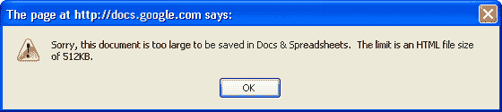

# 

> 原文：<https://web.archive.org/web/http://www.techcrunch.com:80/2006/10/24/digg-does-the-acquisition-dance-with-news-corp/&frame=true/>

ThinkFree 首席执行官 TJ Kang 将于今天晚些时候在 Ajax World 上发表演讲，谈论 Ajax 应用程序以及 ThinkFree 在线文档、电子表格和演示文稿快速编辑器的未来。4 月份，ThinkFree 将发布新版本的 Ajax 架构，可以更准确有效地处理上传的文档，尤其是微软的文档。

ThinkFree 的新架构弥补了其他 Ajax 编辑器的不足，即大文件和保留上传文件的格式。作为文档编辑器的一个例子，ThinkFree 上的[这个](https://web.archive.org/web/20070320214751/http://www.thinkfree.com/fileview.tfo?method=callFileView&filemasterno=747287&filekey=npvz5nmu0o)这样的文件目前可以破解 [Google Doc](https://web.archive.org/web/20070320214751/http://www.techcrunch.com/2006/10/10/google-docs-spreadsheets-launches/) 和 Zoho Writer。谷歌被 1MB 的文件大小噎住了，Zoho Writer 搞乱了格式(见[此处](https://web.archive.org/web/20070320214751/http://writer.zoho.com/public/nickg/BottomLine0401041))。

Google 试图保持较小的文件大小(512 KB)以保持广泛的可访问性，因为 Ajax 编辑器必须适应浏览器的内存限制。Zoho 没有这么低的文件大小限制，但如果你在它的编辑器中编辑一个大文档，你可以看到你的浏览器的内存使用随着你添加更多的内容(尤其是图像)而激增。为了解决这些问题，当新版本完全实现时，ThinkFree 将使用四层存储。在客户端，ThinkFree 只将用户最可能需要的数据存储在浏览器的内存和缓存中，其余的数据存储在服务器内存和硬盘中。

为了更好地处理演示问题，ThinkFree 跟踪对上传的 Microsoft 文件进行的格式化，这在 Ajax 编辑器中无法可靠地模拟。CSS 在布局方面表现得非常好，但在编辑复杂的格式时却是一头野兽，比如文本溢出到多列中或者图像锚定到文本上。为了解决这个问题，ThinkFree 会在上载时跟踪文档格式，如果编辑会破坏文档，它会发出警告，并在下载时重新应用 MS 格式。你可以在他们的[演示](https://web.archive.org/web/20070320214751/http://www.thinkfree.com/fileview.tfo?method=callFileView&filemasterno=746878&filekey=pkaw0lrvq5)中看到更多的技术细节。

虽然当他们的文档编辑器切换时，这些变化将是最明显的，但 ThinkFree 也将改造他们落后的在线演示产品，增加一个所见即所得的 Flex 编辑器。

ThinkFree 目前拥有超过 250，000 名注册用户，其中 10%的人每周至少使用一次他们的应用程序。尽管他们也有更强大的在线 JVM 文件编辑器，但 Ajax 版本使用得更频繁。在不久的将来，超级用户将能够使用他们的[桌面编辑器](https://web.archive.org/web/20070320214751/http://product.thinkfree.com/desktop/)的简化版本来在线管理和同步他们的 ThinkFree 文档。

ThinkFree 与韩国最大的搜索引擎 Naver(据 Kang 称，Naver 占韩国搜索流量的 67%)达成的一项为期三年的协议(T3)也已接近一年，该协议旨在处理用户浏览器中的电子邮件附件。

[Sphere It](https://web.archive.org/web/20070320214751/http://www.sphere.com/search?q=sphereit:http://www.techcrunch.com/2007/03/20/thinkfree-apps-to-get-bigger-and-better/ "Related Blogs & Articles")