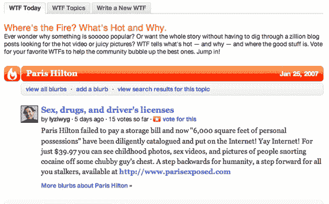
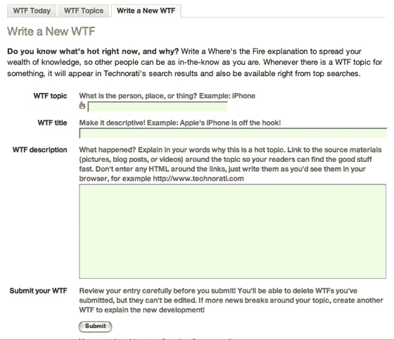
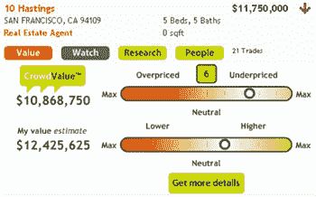

# Techcrunch

> 原文：<https://web.archive.org/web/http://www.techcrunch.com/2006/08/24/lets-share-some-files-four-services-compared/&js=1&rnd=0.03574085792376269>

## January 31

### Michael Arrington

Yahoo’s brand-centric sites, [announced](https://web.archive.org/web/20070131174308/http://www.variety.com/article/VR1117954662.html?categoryid=18&cs=1&nid=2570) in November 2006 and dubbed “Brand Universe”, have started to go live. These sites each revolve around a single popular brand - like this one on the [Nintendo Wii](https://web.archive.org/web/20070131174308/http://wii.yahoo.com/) - and have almost no original content. Instead, Yahoo is taking content from Flickr, Del.icio.us, Yahoo Answers and other Yahoo properties, along with some slick graphics, and hoping for page views.

Yahoo says to expect [100 or so](https://web.archive.org/web/20070131174308/http://www.nytimes.com/2007/01/31/technology/31yahoo.html) brand-based sites by the end of the year, and will include sites for popular movies, TV shows, bands, celebrities, games, etc. The next sites to be launched will include the Sims, Halo, Lost, the Office, Transformers, and Harry Potter, says [GigaOm](https://web.archive.org/web/20070131174308/http://gigaom.com/2007/01/30/has-yahoo-picked-marketing-as-its-game/).

Yahoo doesn’t seem too concerned with monetization of these pages yet, and they aren’t working directly with the brands themselves. Chances are both of those policies may change in the near future.

[Sphere It](https://web.archive.org/web/20070131174308/http://www.sphere.com/search?q=sphereit:http://www.techcrunch.com/2007/01/31/yahoos-brand-universe-launches/ "Related Blogs & Articles")

Posted in [Company & Product Profiles](https://web.archive.org/web/20070131174308/http://www.techcrunch.com/category/company-product-profiles/ "View all posts in Company & Product Profiles") |

### Michael Arrington

[Steve Rubel](https://web.archive.org/web/20070131174308/http://www.micropersuasion.com/2007/01/new_technorati_.html) somehow came across a new Digg-like Technorati product called “WTF,” which stands for “Where’s the Fire?” It was briefly live at [technorati.com/wtf](https://web.archive.org/web/20070131174308/http://www.technorati.com/wtf/), but is no longer available.

From the screen shots (see below, care of Rubel), it appears to have very similar features as Digg, where users can vote for stories they find interesting and force them higher in results.

I’ve emailed Technorati for a comment but haven’t heard back yet. This may be a product that they did not intend be available for public scrutiny quite yet, and Rubel’s post may have resulted in them removing it.

Technorati launched a [TechMeme](https://web.archive.org/web/20070131174308/http://www.techcrunch.com/tag/techmeme)-like site called [Technorati Explore](https://web.archive.org/web/20070131174308/http://kitchen.technorati.com/explore/) in early 2006\. I just checked it on a whim to see if it was still live - and it’s been removed as well. I can’t find any announcement of the product going dark, so it may have been any time in the last few months.

[Sphere It](https://web.archive.org/web/20070131174308/http://www.sphere.com/search?q=sphereit:http://www.techcrunch.com/2007/01/31/technoratis-mysterious-disappearing-wtf-product/ "Related Blogs & Articles")

Posted in [Company & Product Profiles](https://web.archive.org/web/20070131174308/http://www.techcrunch.com/category/company-product-profiles/ "View all posts in Company & Product Profiles") |

## January 30

### Michael Arrington

[PriceProtectr](https://web.archive.org/web/20070131174308/http://www.priceprotectr.com/) is a neat new tool that helps you take advantage of guarantees by many online retailers to refund the difference on purchased items if the price drops in the 30 or 60 days following your purchase (example - Best Buy’s [policy](https://web.archive.org/web/20070131174308/http://www.bestbuy.com/site/olspage.jsp?type=page&entryURLType=&entryURLID=&categoryId=cat10011&contentId=1118843518460&id=cat12098)). Those guarantees are great, but few people go to the trouble of following up and checking on any price changes for items they’ve purchased.

The company has put together a very simple website, even using a vowel dropping name and the generic [web 2.0 logo generator](https://web.archive.org/web/20070131174308/http://www.techcrunch.com/2006/08/20/bullshitr-is-good-for-a-laugh/) that we’ve previously written about. To use it, you simply paste in the product URL from an ecommerce site ([example](https://web.archive.org/web/20070131174308/http://www.bestbuy.com/site/olspage.jsp?skuId=7730217&type=product&productCategoryId=pcmcat95100050006&id=1140392384567)) and your email address. The company will notify you if the price drops within the time period allowed by the retailer.

As of today, the site claims to have found over $57,000 in savings, with few people aware of the service. This might be something someone just put up for fun, but it is a useful tool. Frankly, retailers should email you themselves if the price drops, and if a service like this gets popular enough, they may start doing that. Supported sites include Amazon.com, Amazon.ca, Amazon.co.uk, Backcountry.com, BestBuy.com, BestBuy.ca, Bike Nashbar, Circuit City, Cooking.com, Costco, Future Shop, Jenson USA, Office Max, Sears, 6th Avenue Electronics, Staples.com, Staples.ca, and Target. See [Thrillist](https://web.archive.org/web/20070131174308/http://www.thrillist.com/archives/2007/01/nation_130_tues.html) for their review as well.

[Sphere It](https://web.archive.org/web/20070131174308/http://www.sphere.com/search?q=sphereit:http://www.techcrunch.com/2007/01/30/protect-yourself-from-price-drops/ "Related Blogs & Articles")

Posted in [Company & Product Profiles](https://web.archive.org/web/20070131174308/http://www.techcrunch.com/category/company-product-profiles/ "View all posts in Company & Product Profiles") |

### Michael Arrington

For [good or bad](https://web.archive.org/web/20070131174308/http://www.techcrunch.com/2007/01/07/bubble-bubble-bubble/), venture funds are flowing like it’s 1999 all over again. Seattle-based [Farecast](https://web.archive.org/web/20070131174308/http://www.techcrunch.com/2006/11/13/farecast-selling-airline-ticket-price-guarantees/) , which predicts and [guarantees](https://web.archive.org/web/20070131174308/http://www.techcrunch.com/2007/01/21/farecasts-price-guarantee-on-flights-goes-live/) airline prices, dipped its toes in the cash pool for its third round of financing, taking $12.1 million from Sutter Hill Ventures and others. Previous investors Greylock Partners, Madrona Venture Group, and WRF Capital also participated, as well as new investors PAR Capital Management, Pinnacle Ventures, and Farecast board member and former Expedia CEO, Erik Blachford.

The company has now raised $20.6 million over three rounds. How are they doing? The model seems to be attractive to consumers. Farecast VP Marketing says in just the last few months since launch they’ve “dropped off $200 million in “potential” revenue to airline websites,” a fraction of which will have resulted in actual sales.

[Sphere It](https://web.archive.org/web/20070131174308/http://www.sphere.com/search?q=sphereit:http://www.techcrunch.com/2007/01/30/farecast-takes-12-million-more/ "Related Blogs & Articles")

Posted in [Company & Product Profiles](https://web.archive.org/web/20070131174308/http://www.techcrunch.com/category/company-product-profiles/ "View all posts in Company & Product Profiles") |

### Nick Gonzalez

In a battle for relevance in the mobile payments space, mobile to mobile payment service [Obopay](https://web.archive.org/web/20070131174308/http://www.techcrunch.com/2006/03/29/obopay-set-to-launch-more-mobile-payments/) has acquired social payment service [Billmonk](https://web.archive.org/web/20070131174308/http://www.techcrunch.com/2006/01/20/billmonk-social-money/). Neither are disclosing the size of the acquisition, which is undoubtedly a tiny and probably stock for stock deal. The integration of the two services will first let users settle the debts they tracked on Billmonk instantly over Obopay’s mobile payment platform and eventually by email. You can see Obopay’s release [here](https://web.archive.org/web/20070131174308/https://www.obopay.com/consumer/PDFs/Obopay%20BillMonk%20Release.pdf) and Billmonk’s [here](https://web.archive.org/web/20070131174308/http://billmonk.wordpress.com/2007/01/30/billmonk-is-now-an-obopay-company-settle-up-online/). Founders Gaurav Oberoi and Chuck Groom will be moving to Obopay’s new Seattle office to focus on solving the “social accounting problem”.

This is a crowded space with a single, hugely dominate player, [PayPal Mobile](https://web.archive.org/web/20070131174308/http://www.techcrunch.com/2006/03/22/paypal-mobile-launches-and-its-awesome/). See [TextPayMe](https://web.archive.org/web/20070131174308/http://www.techcrunch.com/2006/02/15/everyone-send-me-5/) and [KushCash](https://web.archive.org/web/20070131174308/http://www.techcrunch.com/2007/01/30/kushcash-tackles-the-untackleable/) as well.

No Tags

[Sphere It](https://web.archive.org/web/20070131174308/http://www.sphere.com/search?q=sphereit:http://www.techcrunch.com/2007/01/30/minimerger-obopay-aquires-billmonk/ "Related Blogs & Articles")

Posted in [Company & Product Profiles](https://web.archive.org/web/20070131174308/http://www.techcrunch.com/category/company-product-profiles/ "View all posts in Company & Product Profiles") |

### Nick Gonzalez

[My Currency](https://web.archive.org/web/20070131174308/http://my-currency.com/) is launching another take on the wisdom of the crowds, this time aimed at the real estate market. Unlike [Zillow](https://web.archive.org/web/20070131174308/http://www.techcrunch.com/2006/04/13/zillow-goes-3d/), My Currency derives its housing valuations from the marketplace of user opinions by having them assess properties as over or undervalued along with the strength of their conviction. For instance, if I feel a house in San Francisco for 11 million dollars is overpriced, I vote for what lower price I think is right as well as how strongly I feel that on a 1-10 scale. The conviction of my choice and the accuracy of my past votes play into how much I can affect the valuation and price trend of the home. Home listings are a bit sparse at the moment, and rely on self listing.

The hope is that experts and real estate agents will be drawn to the site and its users as a lead generation tool. Quality lead generation has been a problem for online realtors. Founder Karim Tahawi says that 2 out of 3 internet leads produce no sale. The site will allow realtors to make one on one contact to buyers by answering direct questions or attracting clients with their reputations. Experts will establish themselves by their voting records and distinguish themselves as the best at valuing different cities or neighborhoods.

Why be honest in your valuation? My Currency answers this through a reputation score that consists of your past performance valuing homes, contributions to the site, and popularity of your additions. These all play a part in the formula that weights your vote on a property. Contributions are measured on the volume of contributions to the supporting blog, wiki, and Q&A pages. Users that produce more frequently viewed content or selected answers, will have higher popularity scores.

My Currency is San Francisco based and currently angel financed.

[Sphere It](https://web.archive.org/web/20070131174308/http://www.sphere.com/search?q=sphereit:http://www.techcrunch.com/2007/01/30/my-currency-launches-crowd-based-home-valuations/ "Related Blogs & Articles")

Posted in [Company & Product Profiles](https://web.archive.org/web/20070131174308/http://www.techcrunch.com/category/company-product-profiles/ "View all posts in Company & Product Profiles") |