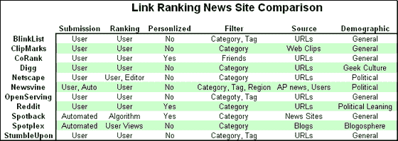

# 

> 原文：<https://web.archive.org/web/http://www.techcrunch.com/2007/03/16/whos-taking-on-digg/&js=1&rnd=0.06970704831309227>

Digg 在 2004 年推出时彻底改变了社会新闻。从那以后，它成为新闻链接排名网站无可争议的冠军。他们最近刚刚突破了百万大关。而且他们的影响力远不止那些用户注册号码。

Digg 重要性的切实证据:克隆的原始数量和 Digg 游戏计划。我们已经看到了[操纵](https://web.archive.org/web/20070318010603/http://www.techcrunch.com/2006/10/18/spike-the-vote-another-cancer-aimed-at-digg/)、[选票收买](https://web.archive.org/web/20070318010603/http://www.techcrunch.com/2007/02/01/digg-removes-list-of-top-users/)、[剖面销售](https://web.archive.org/web/20070318010603/http://www.techcrunch.com/2006/07/30/digg-profile-for-sale-on-ebay/)，指责[暴徒统治](https://web.archive.org/web/20070318010603/http://blogs.zdnet.com/social/?p=39)。几十个克隆版本包括一个不错的 SourceForge 项目，叫做 [Pligg](https://web.archive.org/web/20070318010603/http://sourceforge.net/projects/pligg/) ，它让用户“建立他们自己的 Digg”。

但是 Digg 的无处不在和影响力并不意味着它是完美的。许多创业公司正在解决与 Digg 相同的问题——通过链接提交和某种形式的投票来分享好的内容。其中之一 stumbleupon 实际上比 Digg 拥有更多的注册用户。不过，在很大程度上，这些网站不会对 Digg 的稳定增长造成太大损害。但是它们中的许多都值得一看，而且它们都有各自的特点，如果整合到 Digg 中，会使它成为一个更好的整体服务。

*Personalized refers to recommendations uniquely tailored for each user

**blink list**
blink list 对 Digg 模型采取分布式的方法。它让任何人都可以获得自己的链接博客，在那里他们可以添加自己的收藏夹。然后 BlinkList 查看整个网络，并根据有多少其他用户添加了该链接对网站进行排名。

**剪辑标记**
[剪辑标记](https://web.archive.org/web/20070318010603/http://www.techcrunch.com/2007/02/27/clipmarks-a-highlighter-for-the-web/)让用户只分享网页中最精彩的部分，而不是完整的网址。使用他们的插件，你可以从网页上捆绑你喜欢的内容。这包括文本以及图片和视频。然后，社区的其他成员会“弹出”提交的内容，最受欢迎的位于顶部。使用这个插件，你也可以把你的剪辑提交到你的博客上。目前，该网站的双窗格页面布局给我的感觉是通过轮船的舷窗看网络。

**CoRank**
[CoRank](https://web.archive.org/web/20070318010603/http://www.techcrunch.com/2007/03/08/corank-launches-twist-on-social-bookmarking/)对抗 Digg 上的暴民心态。Digg 基于整个社区的投票将故事推广到首页，导致兴趣不同于人群的用户噪音很大。CoRank 可以让你查看所有提交的链接，或者通过订阅你选择的用户的链接来过滤掉干扰。只有你订阅的来源中收视率最高的故事才会出现在你的头版。

**网景**
[网景](https://web.archive.org/web/20070318010603/http://www.techcrunch.com/2006/06/14/aol-netscape-launches-massive-digg-like-site/)也采取了 Digg 的暴民心态，混进自己的主播团队提交故事，剔除垃圾信息。这位主播的故事和当前排名前 25 的故事一起出现在首页。他们也因为他们的招聘行为陷入了一点小麻烦。Netscape 在其首页管理了更多种类的内容，从 10 个最受欢迎的频道中各抽出 2 个故事，从接下来的 5 个最受欢迎的频道中各抽出 1 个故事。

**news vine**
不是对所有人免费提交， [Newsvine](https://web.archive.org/web/20070318010603/http://www.techcrunch.com/2005/11/09/newvine-to-enter-social-news-ranks/) 实现了自己形式的质量控制，只允许用户对来自美联社和其他用户个人文章的内容进行投票。用户可以获得美联社所有最新报道的实时反馈，对文章进行投票，并在他们的个人专栏页面上撰写自己的文章。Newsvine 与用户分享你的专栏页面上的广告产生的所有收入的 90%。用户还可以个性化他们的订阅源

**open serving**
open serving 是 Wikia 的一个产品，BlinkList 的开源版本是为了好玩或者盈利而工作。概念是相同的，一个链接的个人页面，由你的朋友民主地排列，但是它也让你在站点上张贴你自己的广告。

**Reddit**
[Reddit](https://web.archive.org/web/20070318010603/http://www.techcrunch.com/2006/10/31/interview-with-reddit-founders/)在康泰纳仕[收购他们](https://web.archive.org/web/20070318010603/http://www.techcrunch.com/2006/10/31/breaking-news-conde-nastwired-acquires-reddit/)的时候上了头条。这个网站是我最喜欢的，并且仍然在运行，与 Digg 有一些关键的不同。Reddit 排名是基于绝对投票的(+1 代表热门，-1 代表冷门)，这意味着一个故事可以在 Reddit 的首页上上下下跳舞，而不是被少数超级用户埋没。为了看看现在最流行的是什么，还有一个“热门”列表。这种投票系统也意味着首页会停滞不前，这让一些用户懊恼不已，但它也避免了 Digg 的贿赂丑闻。Reddit 的另一个更大的区别是他们的推荐文章页面，它根据你的投票模式推荐链接。

**spot back**
[spot back](https://web.archive.org/web/20070318010603/http://www.techcrunch.com/2007/03/11/spotback-launches-their-rate-everything-widget/)是 Digg 的自动化替代品，旨在使用个性化来提高你所看到的故事的信噪比。你通过点击 Spotback 挖掘出的故事并进行投票来训练它。对一个故事投赞成票会让 Spotback 揭示下一个最相关的故事。Spotback 最棒的一点是，它甚至不需要注册就可以运行。

**spot plex**
[spot plex](https://web.archive.org/web/20070318010603/http://www.techcrunch.com/2007/02/28/exclusive-is-spotplex-a-better-digg/)是另一个自动链接网站，它自动提交带有其徽章的博客中的故事。然后，在 Spotplex 主页上，根据文章的浏览量对文章进行排名(算法仍在调整中)。该网站的自动化和严密控制的 blogroll 似乎避免了 Digg 遭受的操纵类型，但它缺乏使这些社交媒体网站上瘾的评论者社区。

**stumble upon**
[stumble upon](https://web.archive.org/web/20070318010603/http://www.techcrunch.com/2006/07/18/stumbleupon-now-ie-friendly/)在发现和挖掘链接的同时提供了不一样的用户体验。你使用 tooblar (FF & IE)来标记、提交和投票链接。虽然该网站对链接进行排名，但主要的体验是在互联网上随意走动。它抓住了 Diggs 最大的优势，一个容易访问的有趣链接的持续流。StumbleUpon 绝对是在追赶潮流，他们最近 [**超过了 200 万用户**](https://web.archive.org/web/20070318010603/http://www.prweb.com//releases/2007/3/prweb511876.htm) 。

[Sphere It](https://web.archive.org/web/20070318010603/http://www.sphere.com/search?q=sphereit:http://www.techcrunch.com/2007/03/16/whos-taking-on-digg/ "Related Blogs & Articles")