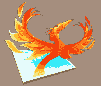
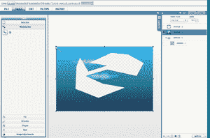
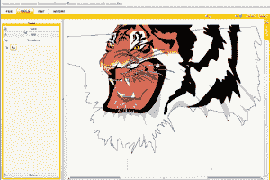

# 

> 原文：<https://web.archive.org/web/http://www.techcrunch.com/2006/11/29/spokeo-aggregates-social-networks-and-blogs/&js=1&rnd=0.282331871729808>

 身价 1000 的和 [Plime](https://web.archive.org/web/20070715022342/http://plime.com/) 背后的家伙们一直在一家名为 Aviary 的新企业中工作(尽管它令人困惑地在[CreationOnTheFly.com](https://web.archive.org/web/20070715022342/http://creationonthefly.com/)举办)。通过 Aviary，纽约的团队瞄准了一个雄心勃勃的目标，不仅为多媒体艺术品创建了一个市场，而且还创建了一套强大的协作在线应用程序来创建作品。

一个显而易见的问题是“为什么既要工具又要市场？”正如创始人 Avi Muchnick 所认为的，两者都是对方成功的必要条件。他们需要一个市场，让创作者出售他们的作品，并鼓励使用这些工具。他们需要工具来确认和维护在平台上创作的作品的版权。

一个挥之不去的问题是，在线工具是否有足够高的水准来生产适销对路的内容。迄今为止，迹象表明答案是肯定的。

完工后，Aviary 将由不同复杂程度的 [14 个在线工具](https://web.archive.org/web/20070715022342/http://www.creationonthefly.com/tools)组成:图像编辑器、颜色样本生成器、图案生成器、基于矢量的编辑器、3D 建模器、音频编辑器、音乐生成器、视频编辑器、桌面出版工具、文字处理器、绘画模拟器、定制图像产品创建器、照片分析器和存储所有这些的文件系统。每个应用程序都是用 Flex 编写的，一旦 Adobe AIR 公开发布，它们就可以和你的桌面融合在一起。添加一个艺术的扭曲，每个工具将被命名为不同的鸟。

这些程序中创建的所有项目都将存储在它们自己的文件系统中，称为 Rookry。从那里，艺术家们将能够在公开市场上出售他们的作品。即使是很小的作品，如图案或音效也会很有市场。如果作品是在鸟舍内制作的，买家会有安全感，知道他们买的是原创作品。如果它们包含外部内容，它们将被标记为外部内容。在 Aviary 的平台上，艺术家也可以创作衍生作品，同时保留销售时的归属权和版税。

团队将在工具完成后发布它们。他们已经用他们的图像编辑器(Phoenix)、矢量编辑器(Raven)和 3D 编辑器(Hummingbird)展示了一些非常重要的结果，如下所述:

**凤凰**

 凤凰就像 Photoshop，没有试图取代它。你得到了许多熟悉的功能，如画笔，图案，印章，涂抹，形状，混合选项，等等。

Aviary 团队通过使用 Worth1000 对他们的 Photoshop 狂热者进行投票，找到 PhotoShop 最常用的功能，从而决定了一个核心功能集。编辑器可以处理最大尺寸为 2880 x 2880 像素的图像。

编辑器确实支持导入和导出熟悉格式的图像，但是任何包含不是在套件中创建的导入图像的鸟舍作品都会在市场中标记出来。这将有助于提醒买家创作者对作品没有完全版权的可能性。

**渡鸦**

 Raven 是他们基于矢量的绘图程序。它基于 Phoenix 的许多设计，但允许艺术家基于矢量绘图的灵活性(例如，容易缩放/旋转而不损失质量)。Raven 将与 Phoenix 连接，允许在 Raven 中创建的插图在 Phoenix 中光栅化和编辑。

点击右边的图片查看大图。

**蜂鸟**

 蜂鸟是他们完全用 Flex 设计的 3D 编辑器。目前，他们只有一个 3D 模型渲染器和一些基本的编辑工具(元素选择/删除)，但正在开发一个更强大的 UI，用于从头开始创建新模型。

右边的蜂鸟是用引擎实时渲染的，有金属金色的皮肤。

点击图像观看 3D 渲染引擎的实时演示。

<param name="movie" value="http://www.youtube.com/v/sJ2XaIjmJGk"> <param name="wmode" value="transparent"><embed src="https://web.archive.org/web/20070715022342oe_/http://www.youtube.com/v/sJ2XaIjmJGk" type="application/x-shockwave-flash" wmode="transparent">