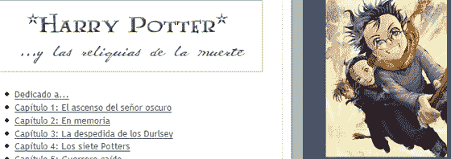

# Techcrunch

> 原文：<https://web.archive.org/web/http://www.techcrunch.com/2006/08/04/dazzle-us-again-delicious/&js=1&rnd=0.5865322335715999>

### 邓肯·赖利

 总部位于内华达州的[你们离婚了](https://web.archive.org/web/20070727002545/http://www.youdeparted.com/)提供了一个加密的电子保险箱，有高达 5GB 的空间，如果会员去世，亲人可以访问

成员使用该服务来存储重要信息和最后的消息。当成员去世时，指定的家庭成员和朋友可以解锁帐户。在帐户可以解锁之前，由成员设置的最小数量的接收者必须独立地验证该成员的通过。一旦帐户解锁，收件人就可以访问专门留给他们每个人的信息，该成员之前写的电子邮件和信件就会被发送出去。

创始人科林·哈里斯(Collin Harris)在父亲突然生病去世后，没有留下遗愿或请求，就有了“你离婚”的想法。几年后，他的家人仍在努力解决与死亡有关的问题，包括骨灰应该撒在哪里。

除了通信和电子邮件，该服务还可用于传递照片集、电影、音频剪辑、文档副本以及该成员希望留给家庭成员的任何其他文件。

离婚人士很快指出，他们不是在与在线遗嘱或遗产规划者竞争；YouDeparted 是一项服务，它始于典型的遗嘱或信任结束的地方。没有人想死，但做好准备也无妨。YouDeparted 是一个聪明的想法，一定会吸引那些准备充分的人，或者那些面临绝症的人。这项服务每年收费 9.95 美元。

张贴在[公司&产品简介](https://web.archive.org/web/20070727002545/http://www.techcrunch.com/category/company-product-profiles/ "View all posts in Company & Product Profiles") |

### 邓肯·赖利

一位粉丝翻译的最新版《哈利·波特》西班牙语版在网上走红。

本月早些时候,《哈利·波特与死亡圣器》成为头条新闻,,英文版在正式发布前就在 Bit Torrent 上找到了它的位置。

可以通过几种方式获得和/或阅读非官方的西班牙语版本:Blogger 上一个名为“西班牙圣器”的博客已经翻译并张贴了每一章，Bit Torrent 和几个文件托管网站上也提供下载。

《哈利·波特与死亡圣器》的西班牙语官方版本要到今年晚些时候才会发布。

总而言之，这并不奇怪。在互联网和痴迷粉丝的时代，控制发行的模式再次失败。

张贴在[公司&产品简介](https://web.archive.org/web/20070727002545/http://www.techcrunch.com/category/company-product-profiles/ "View all posts in Company & Product Profiles") |

### 邓肯·赖利

 微软[今天](https://web.archive.org/web/20070727002545/http://www.microsoft.com/Presspass/press/2007/jul07/07-26AdECNPR.mspx)宣布已经同意收购 [AdECN](https://web.archive.org/web/20070727002545/http://www.adecn.com/) ，这是一家位于圣巴巴拉附近的广告交换平台公司。

AdECN 为在线展示广告提供了一个实时、基于拍卖的中立交易平台，其运作方式类似于证券交易所。AdECN 交易所的成员为其广告商在交易所购买，并为其出版商在交易所出售。

AdECN 是 Right Media 的直接竞争对手，该公司于 4 月份被雅虎以 6 . 8 亿美元收购。微软之前在 5 月份以 60 亿美元收购了在线广告网络 aQuantive。

微软表示，此次收购将帮助微软建立一个全面的搜索和显示广告平台，“帮助广告商和出版商最大限度地提高数字广告投资的投资回报率。”

AdECN 成立于 2003 年。收购价格没有披露。

张贴在[公司&产品简介](https://web.archive.org/web/20070727002545/http://www.techcrunch.com/category/company-product-profiles/ "View all posts in Company & Product Profiles") |

### 迈克尔·阿灵顿

 盖伊·川崎的 [Truemors](https://web.archive.org/web/20070727002545/http://www.crunchbase.com/company/truemors) 正在为脸书测试新版本的[服务。这是一个非常不同于 Truemors.com 的应用程序，它是一种对谣言的挖掘。TFF 是一个应用程序来传播谣言，只是与你的朋友，或朋友的子集:](https://web.archive.org/web/20070727002545/http://truemors.com/tff)

> Truemors.com 和 TFF 非常不同。我们的网站是为了让你“告诉世界”，所以如果你在 Truemors.com 发布了什么，任何有浏览器的人都可以阅读。对于 Truemors.com，我们的目的是尽可能广泛地传播信息。
> 
> 相比之下，TFF 让你“告诉你的朋友”你可以发布一些只有你的朋友可以阅读和讨论的东西。事实上，你可以做得更具体:选择几个你的朋友。

在此为好友添加 true mors[。](https://web.archive.org/web/20070727002545/http://www.facebook.com/apps/application.php?api_key=c3422ef6a256698bf74b543f93d87ef3)

张贴在[公司&产品简介](https://web.archive.org/web/20070727002545/http://www.techcrunch.com/category/company-product-profiles/ "View all posts in Company & Product Profiles") |

### 邓肯·赖利

[ThinkFree Premium Edition](https://web.archive.org/web/20070727002545/http://www.thinkfree.com/common/betauser.tfo?method=goBetaPremiumRequestDesc)，这是一款桌面客户端，提供无缝的微软 Office 风格的离线和在线功能，最近在封闭测试版中推出，我们为 TechCrunch 读者提供免费邀请。

向 techcrunch@thinkfree.com 发送电子邮件的前 50 名读者将获得说明并获得 ThinkFree Premium 的测试版。

ThinkFree premium edition 提供与 ThinkFree 网络版相同的功能，但在桌面上。功能包括文件同步功能，使在线和离线文档保持最新，包括自动上传在桌面应用程序中创建的文档，以确保随处访问；存档功能、全屏查看和高优先级技术支持。

发布在[公司&产品简介](https://web.archive.org/web/20070727002545/http://www.techcrunch.com/category/company-product-profiles/ "View all posts in Company & Product Profiles") |

### 邓肯·赖利

 Mozilla 首席执行官 Mitchell Baker 呼吁社区对开源电子邮件客户端雷鸟的未来提供反馈，并考虑将雷鸟分拆为一个独立的实体。

Mitchell [写道](https://web.archive.org/web/20070727002545/http://weblogs.mozillazine.org/mitchell/archives/2007/07/email_futures.html)雷鸟被“聚焦于网络、火狐和围绕它的生态系统的巨大能量和社区”相形见绌，结果雷鸟没有得到应有的关注。

米切尔提出的选择包括:

*   一个类似于 Mozilla 基金会的新的非营利组织——雷鸟基金会
*   为雷鸟创建一个新的 Mozilla 基金会的子公司
*   雷鸟是作为一个社区项目发布的，很像 SeaMonkey，雷鸟开发者成立了一个小型的独立服务和咨询公司来继续开发和照顾雷鸟用户

雷鸟有很多粉丝。然而，一个可靠的程序并没有像火狐那样快速成长。希望这种变化将重新关注为雷鸟带来新的功能，这些变化可能会使雷鸟成为功能齐全的未来展望替代产品。

张贴在[公司&产品简介](https://web.archive.org/web/20070727002545/http://www.techcrunch.com/category/company-product-profiles/ "View all posts in Company & Product Profiles") |