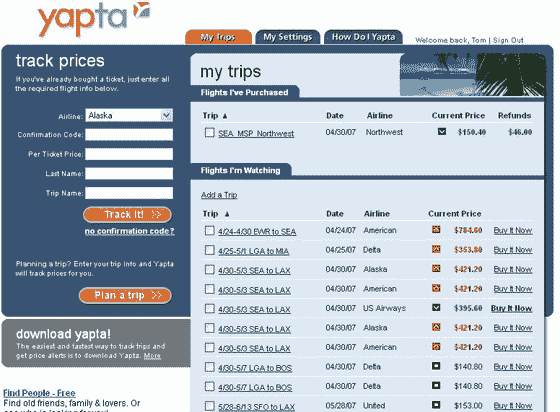
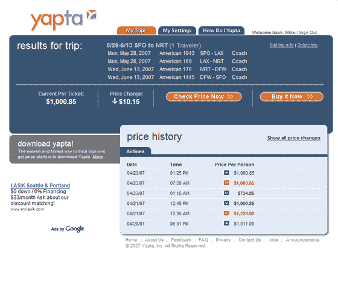

# 

> 原文：<https://web.archive.org/web/http://www.techcrunch.com/2006/08/24/lets-share-some-files-four-services-compared/&js=1&rnd=0.6076386138015792>

 我不知道西雅图和旅游初创公司有什么关系，但新来者 [Yapta](https://web.archive.org/web/20070425131826/http://www.yapta.com/) 现在加入了 [Farecast](https://web.archive.org/web/20070425131826/http://www.techcrunch.com/2006/06/26/farecast-airfare-prediction-engine-opens-public-beta-today/) 和 [TripHub](https://web.archive.org/web/20070425131826/http://www.techcrunch.com/2006/08/07/triphub-brings-structure-to-travel-plans/) 的行列，这是我们从那个寒冷多雨的地方跟踪的另外两家初创公司。

昨天，我看到了公司联合创始人兼首席执行官汤姆·罗玛丽(Tom Romary)发布前的演示。该网站将于 5 月 15 日左右推出，帮助用户寻找航班和(今年晚些时候)酒店的优惠。

Yapta 与其他旅游网站有很大不同。它不像 Expedia 和 Oribitz 那样直接连接到航空公司的系统上，也不像 Farecast 那样本质上是一个低价搜索引擎。相反，他们正在利用 del.icio.us 和书签背后的一些想法，为人们搜索廉价航班创造一种潜在的令人信服的新方式。

Yapta 服务的核心是一个浏览器书签插件，让用户“标记”他们在主要旅游网站上找到的票价。在发布时，将支持 10 个航空公司和旅游网站，随着时间的推移，还会添加更多的网站。看到您感兴趣的航班并将其加入书签。航班和票价信息会存储在您在 Yapta 的账户中。

在不同的网站找到一些不同的航班选项，然后回到 Yapta 进行比较。当您乘坐西南航空或捷蓝航空的航班时，这一点尤其有用，因为这些航班不向其他服务提供航班信息。如果在你购买之前票价上涨或下跌，这将会反映在 Yapta 网站上。

如果你从 Yapta 通过点击航空公司或旅游网站进行购买，他们会继续监控价格。如果价格下跌，他们会联系你，建议你联系航空公司，要求退款或机票。所有的航空公司都降价提供这些服务，但很少有消费者跟进。Yapta 会提醒你。

这家公司有相当多的收入来源。如果用户点击并购买了之前书签标记的航班，他们会向大多数航空公司和网站收取会员费。网站上会有一些广告，Yapta 会向选择加入的用户提供类似 Travelzoo 的“交易”信息。最后，对于有资格因价格下降而获得航班优惠券的客户，Yapta 将提供所有工作，以 10%的费用(或 40 美元的固定年费)获得优惠券。

在过去几个月对 275 名用户进行的测试中，Yapta 发现 34%的已购门票有资格退款。平均退款是票价的 16%，即 85 美元。在测试期间，总共有 28，900 美元的潜在退款，或者每个测试用户大约 100 美元。如果 Yapta 能够成功地进入这个退款池并获得一份份额，数字看起来不错。更重要的是，对于消费者来说，这是一项伟大的服务，他们甚至很少费心去检查价格下降。用户也可以通过在 Yapta 网站上输入航班信息来使用 Yapta 的这一功能，他们不需要事先使用 Yapta 服务进行研究或购买。对于很多用户来说，仅仅这一方面的服务就非常吸引人。

我知道我会用到它。

请参见 [Erick Schonfeld](https://web.archive.org/web/20070425131826/http://blogs.business2.com/business2blog/2007/04/startup_watch_y.html) 了解更多信息。几天前，他还看了 Yapta 演示并写了相关文章。

