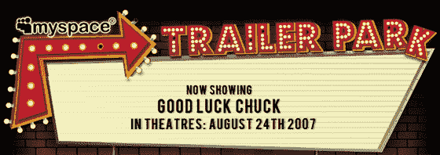

# Techcrunch

> 原文：<https://web.archive.org/web/http://www.techcrunch.com/2006/08/24/lets-share-some-files-four-services-compared/&js=1&rnd=0.7428488741579943>

### 迈克尔·阿灵顿

Netvibes 将为他们 600 名最亲密的朋友举办一场派对，庆祝《Netvibes Universe》即将发布(期待我们的帖子)。这个聚会可以免费参加，但你必须事先答应。Netvibes 创始人塔里克·克里姆(Tariq Krim)同意将最后 50 份邀请函送给 TechCrunch 的读者。如果你想参加，现在在 eco.netvibes.com/sfparty/[回复。50 个位置消失后，该网站将开始创建一个等候名单。](https://web.archive.org/web/20070411015417/http://eco.netvibes.com/sfparty/)

如果你真的打算去，请回复我。否则你会把其他人拒之门外。

**日期:**2007 年 4 月 16 日
**时间:**晚上 9 点
**地点:**加州三藩市明娜街 111 号，邮编:94105

[我们之前对 Netvibes 的报道在这里](https://web.archive.org/web/20070411015417/http://www.techcrunch.com/tag/netvibes)。

张贴在[公司&产品简介](https://web.archive.org/web/20070411015417/http://www.techcrunch.com/category/company-product-profiles/ "View all posts in Company & Product Profiles") |

### 尼克·冈萨雷斯

NetQoS 有一个小东西把视频游戏风格的戏剧带到了监控系统流量的单调任务中。他们的程序， [Netcosm](https://web.archive.org/web/20070411015417/http://www.netqos.com/network%2Dmonitoring/network-monitoring-labs.html) 监控流经路由器的流量，并将这些数据重组为有趣的善恶数据包冲突，就像你上面看到的那样。唯一的问题是，你的系统管理员是否觉得看到你的系统被“划斜线”比什么都不做更有趣。

Netcosm 是 NetQoS 性能实验室的产品，目前只在他们的服务器上运行，但是他们有一个漂亮的 [FAQ](https://web.archive.org/web/20070411015417/http://www.netperformance.com/content.aspx?id=2690&cb_name=1) ，在那里你可以问他们关于他们正在享受的乐趣。

张贴在[公司&产品简介](https://web.archive.org/web/20070411015417/http://www.techcrunch.com/category/company-product-profiles/ "View all posts in Company & Product Profiles") |

### 迈克尔·阿灵顿

今年，维亚康姆对谷歌的态度并不温和。二月份，他们用大规模的 DMCA 下架要求(T2)猛烈抨击谷歌/YouTube(以及同样大规模的媒体宣传)。一个月后，他们[起诉谷歌，要求赔偿 10 亿美元](https://web.archive.org/web/20070411015417/http://www.techcrunch.com/2007/03/13/5217/)。在这两次活动之间，他们[与 YouTube 在专业内容领域的竞争对手 Joost](https://web.archive.org/web/20070411015417/http://www.techcrunch.com/2007/02/20/viacom-to-sign-deal-with-joost/) 签署了一项内容协议。所有这一切似乎都源于这样一个事实，即谷歌向维亚康姆承诺了 YouTube 上的收入分成协议，但却未能提出令人信服的报价。

今天，维亚康姆再次冷落谷歌，选择与雅虎合作搜索广告。交易的细节很少，但雅虎似乎没有做出任何收入保证，这在大型搜索广告交易中已成为标准。谷歌在去年宣布的一笔 9 亿美元的交易中给了福克斯一定的保证，微软几乎肯定会保证脸书的收入，以获得他们的搜索流量。

至少在这种情况下，YouTube 似乎成了谷歌的累赘，而雅虎则受益于成为下一个最强的玩家。

张贴在[公司&产品简介](https://web.archive.org/web/20070411015417/http://www.techcrunch.com/category/company-product-profiles/ "View all posts in Company & Product Profiles") |

### 迈克尔·阿灵顿

今天早上，当我看到来自 MySpace 的一封电子邮件时，我忍不住笑了，邮件中说他们正在推出一项名为“ [TrailerPark](https://web.archive.org/web/20070411015417/http://www.myspace.com/trailerpark) ”的新服务(我想他们可能是针对服务不足的人群进行会员扩展)。但是他们的新服务与此无关。相反，它是一个电影预告片的专用网站。这项服务是通过 [MySpace 视频](https://web.archive.org/web/20070411015417/http://www.techcrunch.com/2006/08/15/comscore-myspace-video-traffic-doubled-in-july/)运行的。

预告片可以在各种网站上找到，但有一个容易浏览和嵌入它们的地方是很棒的。[苹果的](https://web.archive.org/web/20070411015417/http://www.apple.com/trailers/)实际上是最好的之一——它们包括下载到 iPod 或高清格式的选项。其他电影预告片的好网站包括[雅虎电影](https://web.archive.org/web/20070411015417/http://movies.yahoo.com/trailers/)、 [IMDB](https://web.archive.org/web/20070411015417/http://www.imdb.com/) 、[电影列表](https://web.archive.org/web/20070411015417/http://www.movie-list.com/)、 [iKlipz](https://web.archive.org/web/20070411015417/http://www.iklipz.com/Trailers.aspx) 和[电影预告片博客](https://web.archive.org/web/20070411015417/http://movietrailers.blogspot.com/)。YouTube 也有许多电影预告片，尽管它们没有永久的类别。

如果 MySpace 也能显示电影的相关数据，比如上映日期、演员等，那就太好了。没有他们的消息，如果他们计划在未来这样做。

张贴在[公司&产品简介](https://web.archive.org/web/20070411015417/http://www.techcrunch.com/category/company-product-profiles/ "View all posts in Company & Product Profiles") |

### 迈克尔·阿灵顿

 多个消息来源证实[傲游浏览器](https://web.archive.org/web/20070411015417/http://www.maxthon.com/)背后的[中国/以色列创业公司](https://web.archive.org/web/20070411015417/http://www.techcrunch.com/2006/02/28/maxthon-the-browser-that-rocks/)已经向谷歌出售了少数股权。总投资规模据传在 100 万美元左右。我们还听说这项投资是两家公司之间“更大的战略交易”的一部分。

傲游浏览器的下载量已经超过 8000 万次，超过一半的用户在中国。据一位消息人士称，来自傲游的搜索可能占到百度总流量的 25%。

至少，我们预计这项战略交易将包括用谷歌搜索替换中国百度搜索引擎和其他国家雅虎浏览器的默认搜索选项。这笔交易可能还会超出搜索范围，将谷歌的其他服务直接整合到浏览器中。傲游将作为首选浏览器在谷歌上推广。

这笔交易显然至少在两个月前就完成了，但两家公司都推迟了消息的发布。我们就此事联系了傲游公司的 Netanel Jacobsson，但他拒绝发表评论。我们也有一封电子邮件发送到谷歌公关部门进行评论。

在此次投资之前，傲游已经筹集了不到 600 万美元的资金。2005 年 3 月，Morten Lund 和 WI Harper 提供了种子资金，2006 年 3 月，CRV 向该公司投资了大约 500 万美元。

张贴在[公司&产品简介](https://web.archive.org/web/20070411015417/http://www.techcrunch.com/category/company-product-profiles/ "View all posts in Company & Product Profiles") |

### 迈克尔·阿灵顿

Amy Tenderich 写了一篇(如果不是最有影响力的)关于糖尿病的博客，[糖尿病矿](https://web.archive.org/web/20070411015417/http://www.diabetesmine.com/)。注意到今天关于苹果销售第 1 亿台 iPod 的新闻，并称赞苹果产品非凡的工业设计，她请求苹果帮助设计更好的医疗设备。她特别指出了血糖监测器和胰岛素泵(上图中 iPod 旁边的新型胰岛素泵)。看她[给乔布斯的公开信这里](https://web.archive.org/web/20070411015417/http://www.diabetesmine.com/2007/04/an_open_letter_.html)。

她在信中指出，数百万人与他们的医疗设备联系在一起，没有它们他们无法离开自己的家。与 iPod 不同，这些设备有助于糖尿病等慢性疾病患者的生存。

这些设备还有一些与 iPod 不同的地方——合理的设计和吸引人的功能。Tenderich 说“这些设备大部分都很笨重，发出奇怪的警报声，或多或少很难使用，而且电池很快就会耗尽。换句话说:他们的设计无法与 iPod 相提并论。”

她并没有要求苹果真正进入医疗设备行业。相反，她请史蒂夫·乔布斯帮助在这个领域激发一点创造力。她有三个建议:

> 我们已经开始集思广益，你和/或苹果可以采取一些行动来推动这一讨论:
> 
> *赞助一项由苹果公司发起的竞赛，由独立团体评选最佳设计的医疗设备，获胜的产品将获得乔纳森·伊夫本人的精心设计
> 
> *进行一次“医学模型挑战”:苹果设计团队拿出几个现有的医疗设备，演示如何让它们变得更有用、更酷
> 
> *建立苹果医疗设计学院——向来自领先制药公司的精选工程师提供消费者设计概念课程

坦率地说，所有这些对我来说听起来都很棒，如果他们做了其中的任何一项，媒体绝对会大加赞扬苹果。苹果公关，你在听吗？

张贴在[公司&产品简介](https://web.archive.org/web/20070411015417/http://www.techcrunch.com/category/company-product-profiles/ "View all posts in Company & Product Profiles") |