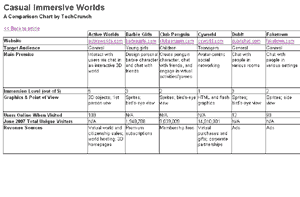

# Techcrunch

> 原文：<https://web.archive.org/web/http://www.techcrunch.com/2006/07/25/youtube-has-porn-clone/&js=1&rnd=0.8286398956248929>

在许多在线虚拟社区中漫游的虚拟角色可能是卡通化的，他们的活动可能无关紧要，但是最近[企鹅俱乐部以 3.5 亿美元的价格出售给迪士尼](https://web.archive.org/web/20070806045007/http://www.techcrunch.com/2007/08/01/disney-acquires-club-penguin/)(赚了 3.5 亿美元)证明了休闲沉浸式世界或虚拟休闲场所的业务[并不完全是](https://web.archive.org/web/20070806045007/http://lsvp.wordpress.com/2007/04/23/kids-and-teens-have-pushed-at-least-6-immersive-online-worlds-to-over-2m-uumth-in-the-us/)的儿戏。

虚拟聚集地是人们可以在虚拟环境中使用虚拟角色相互交流的地方。它们已经在欧洲和亚洲流行多年了。然而，最近它们似乎在美国越来越受欢迎。一些评论家甚至认为，这些目的地提供的体验类型很可能成为即将到来的 Web 3.0 时代的组成部分。

新发布的[多元宇宙平台](https://web.archive.org/web/20070806045007/http://gigaom.com/2007/08/03/second-life-finally-gets-a-direct-competitor-multiverse/)，它是为在线 3D 世界的创建而设计的，当然预见了一个未来，开发者需要必要的工具来建立利基虚拟社区，因为这样的社区已经成为主流。

目前，虚拟场所通过瞄准特定受众并提供某种类型的沉浸式体验来区分自己。

像企鹅俱乐部和 T2 芭比女孩这样的目的地以其简单的用户界面、基本的游戏和卡通图形来迎合儿童和青少年。其他沉浸式世界，如[第二人生](https://web.archive.org/web/20070806045007/http://www.secondlife.com/)和[哈博酒店](https://web.archive.org/web/20070806045007/http://www.habbo.com/)通过提供更高级的聊天功能、更逼真的现实模拟以及设计物体和环境的工具，面向更广泛的受众。然后是红灯区(NSFW)，目标是成熟的成年人，给他们一种更加露骨的娱乐。

 儿童世界的设计考虑到了用户的安全。例如，Webkinz 只允许用户用预先选择好的短语聊天，这样就没有人能说任何不合适的话或分享个人信息。面向普通观众的服务没有这样的限制，理论上所有类型的人都可以享受，尽管这种自由往往会转化为完全不适合儿童的行为。例如,“第二人生”并没有明确提倡成人行为，但却因此变得臭名昭著。拥抱人类行为中更性感的一面，像红光中心这样的服务声称所有时间都是成人的，并鼓励用户参与明确的行为。

虚拟聚集地不仅针对不同的受众，还提供不同程度的沉浸感。有些游戏，如《第二人生》和《活跃世界》,以第一人称视角将你置身于 3D 渲染的环境中，试图接近虚拟现实。其他游戏，比如盖亚([“世界上增长最快的青少年在线游戏”](https://web.archive.org/web/20070806045007/http://gigaom.com/2007/04/22/move-over-myspace-gaia-online-is-here/))和芭比女孩，使用精灵(二维预渲染人物)来提供在基本静态的环境中四处移动的角色的鸟瞰图。甚至更深入的沉浸尺度，某些服务的“世界”如 Cyworld 和 Neopets 仅仅使用 HTML 图像和 Flash 动画制作。

面向年轻观众的娱乐场所通常不如面向成熟观众的娱乐场所那样让人身临其境。也许造成这种情况的唯一原因在于儿童无法驾驭更复杂的模拟世界。然而，儿童和青少年也可能从虚拟聚会中获得与成人完全不同的东西。虽然成年人可能会被这些服务吸引，因为它们提供了逃避现实的机会，但年轻的观众可能会将这些产品视为交互式卡通和玩具。因此，虽然所有这些服务都提供了类似的虚拟约会机会，但它们可能对不同的人群有着根本不同的吸引力。浸泡程度的变化可能会继续反映这些差异。

本文中的图表提供了这些服务的基本比较，以传达当前存在的虚拟聚会的范围。应该指出的是，我们试图在人们闲逛的在线世界和人们玩角色扮演游戏的世界之间做出区分，就像《魔兽世界》的[和《T2》的【安特罗皮亚世界】的](https://web.archive.org/web/20070806045007/http://en.wikipedia.org/wiki/World_of_warcraft)一样。

图表中包括以下服务: