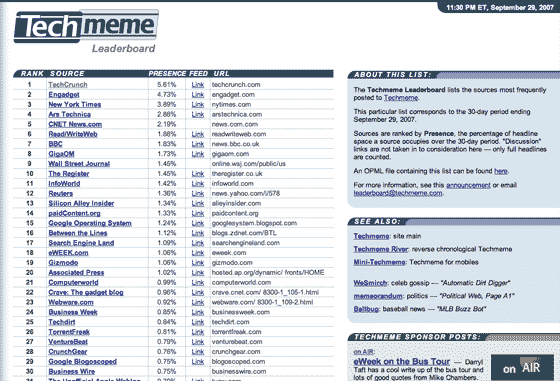

# Techcrunch

> 原文：<https://web.archive.org/web/http://www.techcrunch.com/2007/02/08/a-comparison-of-live-hotmail-gmail-and-yahoo-mail/&js=1&rnd=0.8805638610117441>

博客搜索引擎 [Technorati 的](https://web.archive.org/web/20071001121550/http://www.crunchbase.com/company/technorati)创始 CEO[离职](https://web.archive.org/web/20071001121550/http://www.techcrunch.com/2007/08/16/watching-technorati-and-podtech-fall-apart/)，其[流量派对](https://web.archive.org/web/20071001121550/http://www.techcrunch.com/2007/06/11/technorati-when-will-the-traffic-party-end/)已经结束，其核心搜索功能长期受到谷歌博客搜索、Ask.com 和 Sphere(以及其他)等竞争对手的攻击。持续的战略转移也没有多大帮助。

但是 Technorati 仍然有一个据点——它控制着权威的、没有编辑偏见的顶级博客名单。这份名单是基于过去六个月里独特的博客链接。链接越多=在列表中的位置越高。为了进入前 100 名，一个博客目前需要大约 3700 个独特的链接。

但是，来自其他博客的链接可能不再是一个博客受欢迎程度的最佳指标，特别是在今天，只要打开支票簿并付款，就可以获得博客链接。此外，Technorati 清楚地统计了垃圾邮件和其他博客，这可能对排名产生重大影响。

那是一个将会引起激烈辩论的声明。但是明天博客们将会有一个新的 100 强名单 Techmeme 排行榜。

该列表将基于过去三十天内在 [Techmeme](https://web.archive.org/web/20071001121550/http://www.techmeme.com/) 上创造最多头条新闻的博客创建(因此会经常变化)。

TechMeme 已经成为科技博客新闻的权威网站，它的姐妹网站 [Memeorandum](https://web.archive.org/web/20071001121550/http://www.memeorandum.com/) (政治新闻) [WeSmirch](https://web.archive.org/web/20071001121550/http://www.wesmirch.com/) (名人八卦)和 [BallBug](https://web.archive.org/web/20071001121550/http://www.ballbug.com/) (棒球新闻)在它们的市场上也拥有类似的声望。是时候创始人 Gabe Rivera 开始发布一些伟大的统计数据了，这些数据是他从 2005 年[发布最初的网站](https://web.archive.org/web/20071001121550/http://www.techcrunch.com/2005/10/12/memeorandum-is-changing-the-web/)开始收集的。

确切地说，顶级博客将根据存在情况进行排名——“一个来源在 30 天内占据标题空间的百分比。”讨论链接不被考虑，只有完整的标题才被计算在内。

我认为这是一个比 Technorati 方法更好的排名顶级博客的方法。由于上述原因，Technorati 存在严重缺陷。相比之下，Techmeme 没有垃圾邮件，并且倾向于完美地反映技术博客圈所写的内容。

然而，我有点偏见，因为 TechCrunch 目前排名第一，而 Technorati 仅排名第四。此外，我们的姐妹网站 [CrunchGear](https://web.archive.org/web/20071001121550/http://www.crunchgear.com/) 在 Techmeme 排行榜上排名第 28 位。

期待明天的某个时候，希望我们也能很快看到其他 Techmeme 网站的排行榜。在此之前，请查看上面的截屏，其中只包括排名前 30 位的博客。点击查看大图。

那么你认为给博客排名的更好的方法是什么——Technorati 还是 Techmeme 的方法？或者你有更好的主意？(不用告诉我们，直接建)