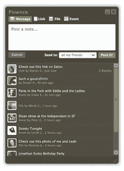

# 

> 原文：<https://web.archive.org/web/http://www.techcrunch.com/2005/12/09/yahoo-acquires-delicious/&js=1&rnd=0.8816148903387693>

### 尼克·冈萨雷斯

Business.com 以 3.5 亿美元将出售给 RH Donnelley([《华尔街日报》](https://web.archive.org/web/20070726115655/http://online.wsj.com/article/SB118541740110378568.html)报道称高达 3.6 亿美元)，结束了其漫长旅程中的另一个篇章。RH Donnelley 在竞标中击败了道琼斯和纽约时报。自 6 月下旬以来，该网站一直在砧板上，并因其古怪的估价而吸引了大量关注，后来证明这些估价更接近事实。

买方 RH Donnelley 是一家目录和在线本地商业搜索公司。他们负责全国的几个白页和黄页目录。Business.com 已经变成了一个商业搜索目录，所以这两个目录网站之间的协同作用似乎很简单。根据 ComScore 的数据，从二月份开始，该网站的流量也有了巨大的增长。

据报道，该物业的 EBITDA 约为 1500 万美元/年。虽然之前的猜测是 25 倍 EBITDA(4 亿美元)的销售倍数，但最终销售价格约为 23 倍。此次拍卖是 1999 年 750 万美元购买价的 47 倍。然而，由于出售的是股票，现金价值[据报道在后来赎回时缩水](https://web.archive.org/web/20070726115655/http://forevergeek.com/news/debunking_the_businesscom_myth_it_wasnt_75_million.php)到 200 万美元。

张贴在[公司&产品简介](https://web.archive.org/web/20070726115655/http://www.techcrunch.com/category/company-product-profiles/ "View all posts in Company & Product Profiles") |

### 迈克尔·阿灵顿

 基于圣地亚哥的存储服务[细流](https://web.archive.org/web/20070726115655/http://www.streamload.com/)正在经历一个地狱般的夏天。

一个多月前的 6 月 22 日，他们开始对这项服务进行“重大改进”。用户在一篇博客文章中被告知，一些文件将暂时无法访问，预计停机时间长达两周。“请放心，我们正在尽一切可能减少服务中断，”他们说。

自那以后发生了什么还不清楚，但事情显然没有按照计划进行。在[7 月 1 日](https://web.archive.org/web/20070726115655/http://blog.mediamax.com/?p=98) Streamload 称他们已经恢复在线。7 月 2 日他们注意到一些问题影响了一些用户。跳到[7 月 21 日](https://web.archive.org/web/20070726115655/http://blog.mediamax.com/?p=102):另一篇记录问题的博文。7 月 24 日[又一次更新，欢迎用户使用“快速的新 MediaMax 数据库和用户界面”](https://web.archive.org/web/20070726115655/http://blog.mediamax.com/?p=103)

总的来说，博客帖子并没有暗示幕后发生了太多混乱，但很明显事情并没有 Streamload 博客暗示的那么顺利。许多客户在这些帖子的评论中抱怨文件删除、中断以及客户服务对他们的问题缺乏回应。在某个时候，Streamload 关闭了评论并删除了所有现有的评论，大概是为了淡化问题。

至少有一个用户创建的博客已经弹出，转载这些博客帖子，添加评论，暗示 Streamload 隐瞒事实，并允许用户发表评论。一些评论者对所谓的掩盖行为感到愤怒:

> Mediamax 不仅仅是不可救药的无能，而是腐败和近乎邪恶！这是腐败，因为它还在为一项不起作用的服务赚钱。它是邪恶的，因为它必须意识到这给许多人带来的难以置信的压力，但它却没有做任何事情来减轻这种痛苦。在他们的博客上说几句诚实的理解的话会有所帮助，而不是他们张贴的废话和谎言。

我已经给 Streamload 发了邮件，希望得到他们的回应。当我有更多的事实时，我会更新这篇文章。

**披露:**我不是这些事件的独立观察者——我是 Omnidrive 的投资者和董事会成员，Omnidrive 也在在线存储领域，可以被认为是 Streamload 的竞争对手。如果人们注意到其他对此的报道，请留下评论，我会在这里链接。到目前为止，我只听说过 Streamload 服务的一些优点，我渴望听到他们的说法。

张贴在[公司&产品简介](https://web.archive.org/web/20070726115655/http://www.techcrunch.com/category/company-product-profiles/ "View all posts in Company & Product Profiles") |

### 尼克·冈萨雷斯

 MySpace 凭借其缩写 webisode、[【舞会皇后】](https://web.archive.org/web/20070726115655/http://www.techcrunch.com/2007/03/29/shakespeare-happy-days-and-prom-queen/)取得了巨大成功。这部被大肆宣传的青少年剧在播出期间吸引了超过 1500 万的流量，并且正在为下一季做准备。MySpace 正在寻求将这种形式带到街上，现在正在为他们自己的短片征集电影制作人，有机会赚一些钱。这是 MySpace 一直在尝试的一系列新想法的一部分，本周早些时候包括一个用户生成的漫画。

MySpace 和美国制片人协会发起了一项名为“讲故事者挑战”的比赛。该竞赛将向电影制作人征集 5-7 分钟的电视试播节目。全部内容将于 2007 年 9 月 4 日开始在 MySpace 的社区页面上展示。前两名获奖者将分别获得 25，000 美元和与福克斯公司达成发展协议的机会。前两个参赛作品将根据用户评分和来自制片人协会的专家小组的综合结果选出。决赛选手将在明年 1 月 6 日和 1 月 25 日结束的两轮比赛中被淘汰。

获奖视频可以在 MySpace Film 和 MySpaceTV 上播放。根据 ComScore 的数据，MySpace 属性驱动了 39%的视频流。

这个新节目类似于刚刚重新推出的[Crackle](https://web.archive.org/web/20070726115655/http://www.crunchbase.com/company/crackle)试图通过在有抱负的演员和导演面前悬挂制作协议来做的事情。虽然大多数视频网站已经放弃了病毒视频，转而使用 YouTube，但专业内容仍然是一个蓬勃发展的市场。名利诱惑下的竞争是廉价从人群中发掘新人才的有效方式。现在是学电影的好时候。

张贴在[公司&产品简介](https://web.archive.org/web/20070726115655/http://www.techcrunch.com/category/company-product-profiles/ "View all posts in Company & Product Profiles") |

### 邓肯·赖利

 美国联邦调查局正在对第二人生中的赌博进行调查，据信这与林登实验室[突然决定](https://web.archive.org/web/20070726115655/http://blog.secondlife.com/2007/07/25/wagering-in-second-life-new-policy)禁止第二人生中所有形式的赌博直接相关。

联邦调查局的调查于 4 月份开始，当时正在考虑虚拟世界中在线赌博的合法性。美国政府禁止大多数形式的在线赌博。

在撰写本文时，尚不清楚联邦调查局是否会进一步处理此事，包括可能逮捕林登实验室主任或起诉个人用户。

在过去的 2-3 年里，赌场和博彩业已经成为元宇宙第二人生的重要组成部分。林登实验室将从这个决定中受到经济打击，因为赌场所有者取消了虚拟土地所有权协议；顶级赌场每月向林登实验室贡献大笔费用。

张贴在[公司&产品简介](https://web.archive.org/web/20070726115655/http://www.techcrunch.com/category/company-product-profiles/ "View all posts in Company & Product Profiles") |

### 邓肯·赖利

 Pownce [宣布](https://web.archive.org/web/20070726115655/http://blog.pownce.com/2007/07/25/coming-soon-the-pownce-public-api/)成立一个小组，致力于实现一个公共 Pownce API。

正如 Pownce 在他们的博客上说得很好，“缺乏 API 从第一天起就是对 Pownce 的主要批评。”桌面交互是 Pownce 的致命弱点；Pownce 桌面 AIR 客户端从第一天起就有缺陷。一个开放的 API 将允许第三方开发者创建新的和改进的桌面客户端、浏览器插件和任何其他他们喜欢的界面，正如许多人已经为 Twitter 所做的那样。

显然，这不是简单地提供一个公共 API 那么简单；Pownce API 的公共部分需要咨询、设计、开发、更多的咨询，以及最后但并非最不重要的“社区评审”,可能的发布日期是 9 月。一切好事都会降临到那些耐心等待的人身上，但是 Pownce 等待发布公共 API 的时间越长，应用程序背后的积极势头消失的风险就越大。

张贴在[公司&产品简介](https://web.archive.org/web/20070726115655/http://www.techcrunch.com/category/company-product-profiles/ "View all posts in Company & Product Profiles") |

### 尼克·冈萨雷斯

 [Adpinion](https://web.archive.org/web/20070726115655/http://adpinion.com/) 是一家新成立的公司，试图通过让你为你想要的广告投票来摆脱广告商和网络冲浪者之间的对立。您的投票方式决定了您和其他访问者在访问 Adpinion 网络网站时看到的广告。

最基本的在线广告类型(横幅广告)普遍不受欢迎；一个例子是对广告拦截器越来越感兴趣(仅在火狐上就有 40 个广告拦截器)。作为回应，谷歌和其他公司正在继续发展他们的上下文广告引擎。Adpinion 的解决方案是授权用户选择他们的广告客户。

Adpinion 通过位于其嵌入式广告单元左侧的投票栏收集您的偏好。您可以使用拇指向上或拇指向下按钮来投票赞成或反对广告。你对每个广告的投票方式决定了你的广告偏好和整个网站的广告偏好。Adpinion 根据您自己的偏好提供广告，但也根据与您相似的用户喜欢的广告来推荐广告。

广告费率将基于点击量，并与广告与你的偏好的匹配程度相关。费率因广告与您偏好的密切程度而异，广告越不相关，费用越高。

由于投票栏的原因，广告横幅确实有比标准单位(468 x 60 单位)宽的缺点。他们计划增加单位面积。

用户反馈模型让我想知道他们是否会得到足够的反馈来做得比自动化系统或高度针对性的网站更好。最大的问题是，人们是有足够的兴趣使用 Adpinion 的投票系统，还是会干脆忽略它。

对于他们的发布，他们只找了几个广告商(37 Signals，CrazyEgg，Mint 等等)，并用自动生成的亚马逊广告填充了剩余的空间。他们计划将网络建成自助服务模式，但还没有完成出版商和广告商管理工具。Adpinion 是一家总部位于波士顿的 Y Combinator 公司，去年由三位创始人卢克·伊安尼尼、迈克·雅各布斯和凯文·科克兰创立。

张贴在[公司&产品简介](https://web.archive.org/web/20070726115655/http://www.techcrunch.com/category/company-product-profiles/ "View all posts in Company & Product Profiles") |