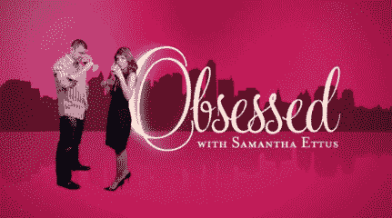

# 加里·瓦伊纳丘克用痴迷的电视扩大他的网络视频帝国

> 原文：<https://web.archive.org/web/http://www.techcrunch.com:80/2006/10/24/digg-does-the-acquisition-dance-with-news-corp/,%20>

加里·维纳查克在追求奥普拉脱口秀。这位葡萄酒批发商以谈论葡萄酒和营销的网络视频名人的身份开始了他的职业生涯，他刚刚推出了由萨曼莎·埃图斯主持的新视频脱口秀[痴迷](http://obsessedtv.com/)。凭借《痴迷》，Vaynerchuk 希望超越网络上的小众节目，吸引主流观众。

该节目的形式是对嘉宾进行 30 至 40 分钟的深度采访，吸引了 25 至 55 岁的女性。目前，网站上的第一个采访对象是美食作家马克·比特曼和花艺设计师普雷斯顿·贝里。未来的嘉宾将包括 *Today Show* 旅游编辑彼得·格林伯格、TreeHugger 创始人格雷厄姆·希尔和 BlogHer 创始人利兹·斯通。(他们也在开发一些更大的品牌)。

Ettus 将主持节目并担任主要明星，而 Vaynerchuk 将在最后出场 3 分钟谈论葡萄酒，这是他的事情。他是[葡萄酒图书馆电视](https://web.archive.org/web/20100213140520/http://tv.winelibrary.com/)的主持人，也定期在[Gary vay ner chuk](https://web.archive.org/web/20100213140520/http://garyvaynerchuk.com/)上提供视频，大部分是关于营销的。Vaynerchuk 说:“我能提供的内容是有限的。“我需要拥有尽可能多的媒体资产。”

Vaynerchuk 和 Ettus 是这部新剧的联合制片人。两人都拥有“努力”背后的制作公司“痴迷电视”的一半股份。Vaynerchuk 的其他项目包括一个 t 恤搜索引擎和一个葡萄酒评级网站，他承诺今年会更加关注这个网站。