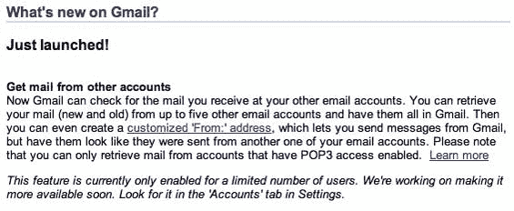

# 哦，Gmail 刚刚变得完美——TechCrunch

> 原文：<https://web.archive.org/web/https://techcrunch.com/2006/12/09/uh-oh-gmail-just-got-perfect/?guce_referrer=aHR0cDovL3NuYXJrbWFya2V0LmNvbS8yMDA3LzE1NTc&guce_referrer_sig=AQAAABC2sjGOyODLi957PqjQu0TijafVwdkXUSmMjacPfHnFiyiFE_GWpTEBDp3Vm8rw3wB17zlyiIRkcm9mqm9QfsMNBmSO4dxChINerjgKz8OMRkzLoA8cKSkjYSkN5X_rJ32tkL83X2mXgq_3qeQJ5VUyuptIIy7ut2ibyhwXZeFb&_guc_consent_skip=1601372932>

# 哦，Gmail 刚刚变得完美了

  谷歌本周悄悄给 Gmail 添加了一个名为[邮件提取器](https://web.archive.org/web/20200929094824/http://mail.google.com/support/bin/answer.py?ctx=%67mail&hl=en&answer=21288)的小功能。当这项功能推出时，Gmail 变得完美了。

邮件提取器允许用户从 Gmail 界面中访问非 Gmail 电子邮件帐户。如果你有一个雅虎邮箱账户，和一个工作邮箱账户，等等。，您只需使用 POP 设置从 Gmail 中访问该电子邮件。Gmail 现在的工作方式与 Outlook 在 PC 桌面上的工作方式非常相似。

这是我过去批评 Gmail 的地方。当讨论新的 Mac 网络邮件产品时，我在这里不停地谈论这个问题。在我看来，这是 Gmail 所缺乏的一个功能，使它无法成为完美的网络邮件应用。

其他所有网络邮件服务现在都不如 Gmail。Gmail 比其他任何免费服务提供更多的存储空间。他们提供从 Outlook 等其他电子邮件应用程序到 Gmail 的免费 POP 访问(雅虎和微软对此收费)。他们提供 Gmail 内其他电子邮件账户的访问权限(只有雅虎提供这一功能)。Gmail 的[移动客户端](https://web.archive.org/web/20200929094824/http://www.beta.techcrunch.com/2006/11/02/gmail-for-mobile-launches-today/)是杀手锏(尽管还不能用于大多数手机)。只有 Gmail 允许在多个主题下对电子邮件进行分类标记(我只希望这是一个更快的功能)。

我正在认真考虑从使用我的桌面电子邮件客户端切换到 Gmail。由于我在多台电脑上工作，使用网络邮件消除了同步问题。如果[谷歌](https://web.archive.org/web/20200929094824/https://crunchbase.com/organization/google) 以类似于 [Scrybe](https://web.archive.org/web/20200929094824/http://www.beta.techcrunch.com/2006/10/31/scrybe-syncing-calendar-has-launched-in-beta/) 的方式或者通过 Adobe 的 Apollo 平台实现 Gmail 的离线版本，它将变得更加引人注目。

感谢谷歌最终实现了这一点。简直太棒了。