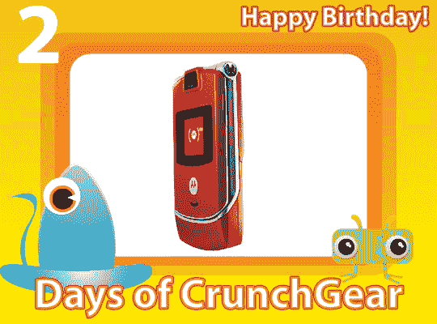

# 10 天的 CrunchGear:来自 Sprint 的瑞德·摩托罗拉·拉兹

> 原文：<https://web.archive.org/web/http://techcrunch.com/2007/08/11/10-days-of-crunchgear-red-motorola-razr-from-sprint/>

# 10 天的嘎吱嘎吱声:斯普林特公司的瑞德·摩托罗拉·拉兹

你有一部旧手机吗？给它拍张照，主题行“红色[RAZRT3”发给 contest@crunchgear.com 我们将随机挑选一名获胜者，从 Sprint 获得这款红色 RAZR 抱歉，不包括服务。请继续阅读规格。](https://web.archive.org/web/20201026101903/https://crunchbase.com/organization/razr)

> * Sprint TV(SM)拥有 50 多个直播电视频道和点播视频和音频。
> * Sprint Movies，美国第一个手机“按次付费”服务，播放完整长度的电影，包括最近的票房大片和永恒的热门电影。
> * NFL Mobile，一款 Sprint 专属的无线应用，让球迷可以访问当天的视频集锦、可定制的实时统计数据、比分、受伤报告和其他信息。
> * Sprint Music Store(SM)，允许用户直接浏览和无线下载完整长度的歌曲到手机。
> * Sprint Power View，业内首个专为移动体育和娱乐视频节目制作的网络。
> 
> MOTORAZR V3m 是摩托罗拉最薄的 CDMA 网络多媒体手机之一，具有精致的金属外壳和雕刻的翻盖形状。红色 MOTORAZR 大胆的红色色调为其超薄、迷人的设计增色不少。
> 
> 红色 MOTORAZR 手机包括五个独特的预装屏幕保护程序。额外的高级功能包括 130 万像素的数码相机，具有 4 倍数码变焦和视频拍摄、播放和流媒体功能；支持 GPS 的蓝牙无线技术* *；免提电话；和一个 MicroSD 存储卡插槽。

引用波拉特的话，“尼利斯！”