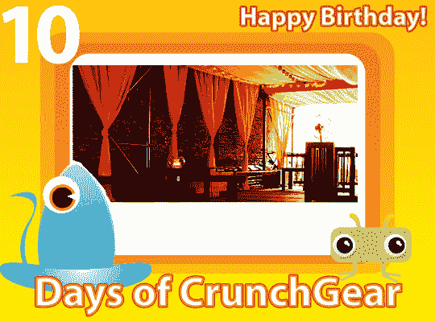

# 10 天的 CrunchGear:生日派对

> 原文：<https://web.archive.org/web/http://techcrunch.com/2007/08/13/10-days-of-crunchgear-the-birthday-party/>

你好，纽约！2007 年 8 月 20 日星期一，晚上 7 点到 11 点，我们将在曼哈顿的 Red Sky 举办一场超级豪华的生日派对。会有一个开放的酒吧——CG 工作人员会像疯子一样分发饮料票——如果你们都能加入我们，我们会很高兴。

[【红色天空】](https://web.archive.org/web/20160914110849/http://www.redskynyc.com/)位于东 29 街 47 号([谷歌地图](https://web.archive.org/web/20160914110849/http://maps.google.com/maps?q=47+e.+29th+street&ie=UTF8&oe=utf-8&client=firefox-a&ll=40.744607,-73.984702&spn=0.007559,0.019376&z=16&iwloc=addr&om=1))，有一个屋顶酒吧，我们都可以在那里见面，用美味的食物互相问候。彼得·哈正在烤饼干，尼古拉斯正在做冰淇淋蛋糕。

如果你要参加，发邮件给 party@crunchgear.com 或回复我们的[脸书活动邀请](https://web.archive.org/web/20160914110849/http://www.facebook.com/event.php?eid=4177489635&pwstdfy=f3d150598ff21137699941f745143ad5)如果你或你的公司想赞助该活动，发邮件给 john@crunchgear.com。我们也想有一些赠品，但钱是好的。钱总是好的。

期待在那里见到你们！