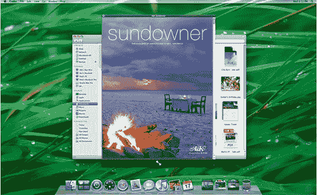

# 关于 Leopard 你不知道的 10 件事:赢得胜利的圆角| TechCrunch

> 原文：<https://web.archive.org/web/http://techcrunch.com/2007/07/09/10-things-you-didnt-know-about-leopard-rounded-corners-for-the-win/>

[豹](https://web.archive.org/web/20150912150720/http://crunchgear.com/category/leopard/)很快就会在你附近的 Mac 电脑上发出咕噜咕噜的声音，但我打赌你不知道它的窗户角是圆形的。你也不知道上下文菜单(当你右击某个东西时)中有额外的条目，比如“Automator”和“发送[图片]到蓝牙设备”你知道吗，自作聪明的家伙？APC Mag 列出了 10 件“你不知道的 Leopard”的事情，虽然我敢打赌你确实知道其中的一些，但你真的必须尊重 APC 对细节的关注。我从来没有看过我的窗户的角落！

我学到的:iCal 没有 Tiger 那么烂。这简直是天赐良机，因为我的日程表*已经全部排满了*，如果你明白我的意思的话。

[关于 Leopard 你不知道的十件事](https://web.archive.org/web/20150912150720/http://apcmag.com/6595/ten_things_you_didnt_know_about_leopard)【APC 杂志】