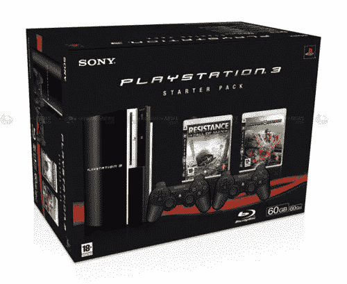

# 120GB PS3 登陆欧洲| TechCrunch

> 原文：<https://web.archive.org/web/http://techcrunch.com/2007/07/19/120gb-ps3-coming-to-europe/>

# 120GB PS3 即将登陆欧洲

像这样，‘cept’120 GB

嗯，也许吧。这是谣言，任何人都可以编造。但是根据秋叶原新闻和其愚蠢的“可靠消息来源”，120GB 版本的 Playstation 3 将以首发包的形式进入欧洲。我猜这个包可能包括几个游戏，120GB 的系统和两个控制器。从这张 PS3 首发包装盒的图片来看，我想我已经非常接近了。

太糟糕了，据传它的价格为 825 美元，没有人想买 PS3。我很确定索尼正在像在盒子里推销 clamidia 一样推销 PS3。没有人想要它，但每天都会有人去捡。哎哟。

[欧洲 PS3 120 GB？](https://web.archive.org/web/20130628193433/http://www.akihabaranews.com/en/news-14399-120GB+for+the+European+PS3%3F.html)【秋叶原新闻