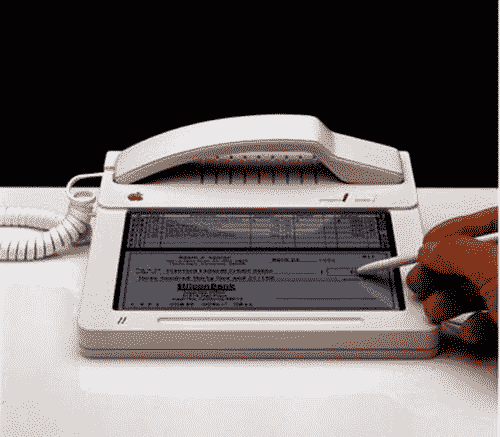

# 20 世纪 80 年代的苹果概念 iPhone 的起源——TechCrunch

> 原文：<https://web.archive.org/web/http://techcrunch.com:80/2007/07/18/1980s-apple-concepts-the-origin-of-the-iphone/>

# 20 世纪 80 年代的苹果概念 iPhone 的起源

“你知道规矩，我也知道！”

早在 80 年代初，苹果就在努力设计新的创新产品。最初设计苹果 IIc 的德国设计师哈特穆特·艾斯林格设计了一些从他创造的电脑中汲取灵感的模拟产品。一张突出的照片是一部带有苹果标志和触摸屏的固定电话。虽然它很难携带，但人们可以很容易地推测这是最终导致 iPhone 诞生的火花。

看看这些潜在产品的概念，有些让我觉得是天才，有些看起来完全是弱智。一台便携式电脑？所以 1985 年。你为什么不去设计一个可以变成腕带的钥匙或尺子，当你在 I-哦等等。那是 20 世纪 80 年代。我的错。我以为我被困在了[里克·阿斯特利的](https://web.archive.org/web/20220216062456/http://youtube.com/watch?v=7sK3AqFYAWQ)大脑里。

[iPhone 的由来](https://web.archive.org/web/20220216062456/http://fudder.de/artikel/2007/07/17/origin-of-the-iphone/)【Fudder】