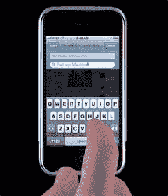

# 20 美元的 iPhone 电池更换套件

> 原文：<https://web.archive.org/web/http://techcrunch.com:80/2007/07/31/20-iphone-battery-replacement-kit/>

苹果不希望你摆弄 iPhone 的电池。真的没有。当你的 iPhone 保修期满时，你必须将它寄回给苹果公司更换电池，并收取额外的费用(79 美元+运费)。是的，这很糟糕，但没有其他选择。还是有？

在亚洲，到处都是 OEM 电池和塑料。只需 20 美元，你就可以为你的 iPhone 得到一个电池更换套件，这个套件可能会让 T2 工作。但要小心，因为拆开 iPhone，更不用说更换电池了，不是一件容易或愉快的事情。问问天才少年就知道了。他差点毁了他的 iPhone，仅仅是为了移除后盖。

[$20 的 iPhone 电池更换套件](https://web.archive.org/web/20160526222000/http://www.i4u.com/article10517.html)【I4U】