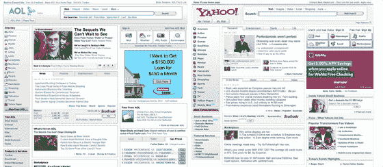

# 美国在线又落后一步:与雅虎相同的新主页

> 原文：<https://web.archive.org/web/http://www.techcrunch.com:80/2007/04/26/aol-one-step-behind-again-new-home-page-identical-to-yahoo/3>

### 迈克尔·阿灵顿

AOL 已经开始测试一个新的主页(AOL.com 的主要门户网站)。美国在线高级产品经理(偶尔也是 TechCrunch 的撰稿人)[弗兰克·格鲁伯](https://web.archive.org/web/20070910201823/http://www.somewhatfrank.com/2007/04/aol_launches_in.html)今天早些时候在他的个人博客上介绍了它，尽管他不是该产品的产品经理。

不错的门户网站……但是它和雅虎主页几乎一模一样，雅虎主页在去年被重新设计。点击上图查看大图。在内部，我听到 AOLers 将新的门户称为“雅虎门户”，尽管它的正式名称是 AOL 3.0。

互联网公司喜欢从他们的竞争对手那里抄袭有用的东西，但是正如我们所看到的，即使是最大的公司有时也会被发现抄袭得有点多。

美国在线表示，他们正在打造同类最佳的产品，而不是简单地从谷歌、雅虎和其他被证明有效的公司复制东西，然后移植给不太前沿的受众。然而，在过去的一年里，我们看到他们大量抄袭 digg，然后发布了一款新的邮件产品，这款产品在两年前可能会很棒，但与当前版本的 Gmail 和 Yahoo Mail 相比却很糟糕。

美国在线门户和个人媒体高级副总裁刘中达告诉我，许多正在开发的新产品将会给人留下深刻印象。我看过其中一些的早期演示和线框，我认为他是对的。该公司需要一个类别杀手来获得一些街头信誉。

该条目于 2007 年 4 月 26 日星期四下午 5:50 发布，并在[公司&产品简介](https://web.archive.org/web/20070910201823/http://www.techcrunch.com/category/company-product-profiles/ "View all posts in Company & Product Profiles")下存档。您可以通过 [RSS 2.0](https://web.archive.org/web/20070910201823/http://www.techcrunch.com/2007/04/26/aol-one-step-behind-again-new-home-page-identical-to-yahoo/feed/) 订阅源关注对该条目的任何回复。评论和 pings 目前都已关闭。