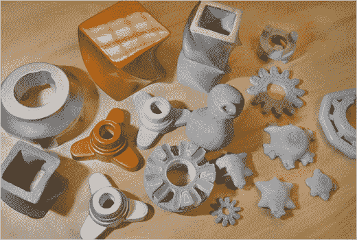

# 3D 打印机让你打印出 3D 物体

> 原文：<https://web.archive.org/web/http://techcrunch.com:80/2007/05/07/3d-printers-let-you-print-out-3d-objects/>

# 3D 打印机让你打印出 3D 物体

它们被称为三维打印机，主要用于工业设计行业——汽车和飞机制造商。例如，在大规模生产前测试设计。我们普通人可以期待在从网上下载计划后，使用打印机来创建我们需要或想要的项目。你讨厌的孩子看到玩具广告上的玩具了吗？下载计划，把它们发到打印机上，然后等一会儿。几分钟后玩具就会出来。这就像《未来》中的一样令人惊叹。

这些打印机的主要制造商之一是[桌面工厂，](https://web.archive.org/web/20201128203959/https://crunchbase.com/organization/desktop-factory) 它表示，这种打印机在大约四年内应该只需要 1000 美元左右。(今年的价格将在 5000 美元左右徘徊。)它的工作原理是用卤素灯将尼龙粉末熔化成想要的形状，上面是一堆小部件，就在这里，Gumby 被制作出来了。

该死，我们今天看到的另一件大事。摇滚起来。

斯科特，把它从网上传下来