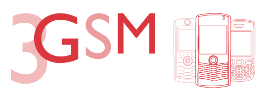

# 3GSM 2007:巴塞罗纳的 crunch gear 

> 原文：<https://web.archive.org/web/http://techcrunch.com:80/2007/02/12/3gsm-2007-crunchgear-in-barcelona/>

刚在 3GSM 安顿下来，我们就已经在刺探秘密和奇怪的发射了。比如说，昨晚我们在抓记者证的时候发现的这个神奇的摩托罗拉产品是什么？在纽约哪里可以买到伊比利亚 jamon，因为那东西很棒？

昨夜之谜。

所有这些和更多的将在接下来的四天里被揭开，但在那之前，请尽情欣赏我们迄今为止看到的一些景观。

致所有巴塞罗那 TechCrunch/CrunchGear 的读者:如果你想在展会结束后见面谈论技术，请联系我。我很乐意和你分享一杯葡萄酒。

或者也许是一些叠层的新鲜朝鲜蓟？

文斯、乔希和布雷克木偶在街上游荡。

