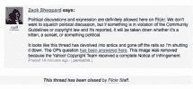

# TechCrunch

> 原文：<https://web.archive.org/web/http://www.techcrunch.com:80/&usg=ALkJrhiov5YDzAA8CnBvx3Dz3IM-48nsQA%2Fpage%2F3%2F/page/4/>

哦，越来越精彩了。或者越来越悲伤。

在今早的一篇[帖子中，我们讨论了 Flickr 删除奥巴马总统的一张 PS 图片的可疑决定，这张图片使奥巴马看起来像《黑暗骑士》中的希斯·莱杰(小丑)。在那篇文章中，我们引用了 Flickr 的社区总监 Heather Champ 在解释为什么图片会从 Flickr 上移除时说的话*“我们非常重视言论自由和创造力”*。我们打电话给 B.S。](https://web.archive.org/web/20090825182128/http://www.techcrunch.com/2009/08/21/flickr-v-free-speech-where-is-the-courage/)

现在，Flickr 已经关闭了对该论坛帖子的进一步评论，这肯定不是朝着支持 Flickr 的方向发展。在关闭讨论的消息中，扎克·谢泼德重申了政治讨论对 Flickr 的重要性:

> 在 Flickr 上，政治讨论和表达是绝对允许的。我们不想压制政治讨论，但如果有东西违反了社区准则或版权法并被报道，它将被删除，无论是小猫，日落，还是政治性的东西。
> 
> 看起来这个帖子已经变得滑稽可笑，脱离了轨道，所以我要关闭它。这里已经回答了 OPs 的问题。此图片已被删除，因为雅虎！版权团队收到完整的侵权通知。

这太荒谬了。雅虎是相当字面上鼓吹，他们支持政治讨论在非常信息，他们正在发送关闭一个政治讨论。