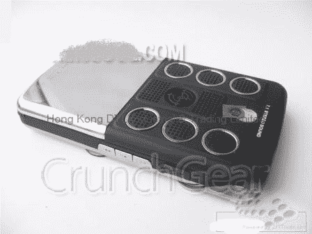

# 7.1 扬声器 Vista 手机:最好的部分？水印大战！| TechCrunch | 40

> 原文：<https://web.archive.org/web/https://techcrunch.com/2007/05/02/71-speaker-cellphone-with-vista-the-best-part-watermark-war/40/>

这款中国智能手机运行 Vista，配有 7.1 环绕声扬声器，看起来可能很蠢，但这不会阻止一个又一个网站运行它，正如我们从上面的图片中看到的那样，它被打上了水印。

它有一个 3.75 英寸的触摸屏，一些豪华的挡风玻璃，有足够的可能性撞上这些海岸，就像一群患狂犬病的狸猫。仅仅为了把这个小花絮扔进那个小玩意儿的气窗，就值得做这么多糟糕的 Photoshoppery 吗？

[全球首款搭载 7.1 扬声器系统和 Vista 的手机](https://web.archive.org/web/20180305191701/http://justamp.blogspot.com/2007/05/worlds-first-mobile-phone-with-71.html)