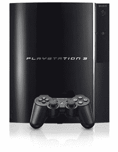

# 60GB PS3 将从北美移除

> 原文：<https://web.archive.org/web/http://techcrunch.com/2007/07/13/60gb-ps3-being-removed-from-north-america/>

啊哦！还记得前几天我是如何谈论[情感引擎](https://web.archive.org/web/20131215011704/http://crunchgear.com/2007/07/10/80gb-playstation-3-wont-have-emotion-engine/)以及 80GB 为什么没有它吗？这基本上意味着，除了 PS2，你在任何地方都找不到情感引擎。索尼不再在美国销售 60GB 型号，一旦 60GB 型号销售一空，将只销售不带 EE 芯片的 80GB 版本。

经 SCEE 总裁 Dave Reeves 证实，索尼表示他们将在海外的 PS3(已经没有情感引擎的 PS3)上使用 60GB 的驱动器。这意味着 60GB 型号基本上在售，降价不会在 6 个月后真正生效。如果你想要一个带情感引擎芯片的 PS3，我建议现在就跑出去买一个。否则，你可能会被迫从 Craigslist 或易贝上买一个，这可能会非常贵。

[E3:Reeves](https://web.archive.org/web/20131215011704/http://crunchgear.com/2007/07/10/80gb-playstation-3-wont-have-emotion-engine/)(游戏行业)表示，7 月份以后，美国将不再销售 60GB 的 PlayStation 3