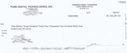

# 

> 原文：<https://web.archive.org/web/http://www.techcrunch.com:80/&usg=ALkJrhjjzIWUPhmdFB8V-HKWF0ozoAolTA/page/2/page/3/www.zimbra.com/desktop/page/2/page/3/page/4/www.zimbra.com/layoffs/%3Ca+rel=/page/7/>

所以今天早上我在这里打开一大堆公司的邮件，账单，希瑟的支票，工资单之类的东西。我撕开所有的信封，然后开始吃。我低头看到这张 130 万美元的支票和零钱。相信我，没有什么比打开一封寄给你的信，发现里面有一张 1，334，261.05 美元的支票更让人激动的了。

第一个想法:哇哦！第二个想法:为什么？第三个想法:哦，这不是写给我的。当然了。第四个想法:哦，糟糕，这是写给我的，但名字写错了，我打开它甚至没有注意到，这是不是犯了重罪(我的律师正在回复我，与此同时，我正在墨西哥快速度假)？

支票来自 Pure Digital Technologies，这家公司最近被思科以 5.9 亿美元收购。支票随附的一封信称，这笔钱代表“你的股票期权的现金净收益。”

发生了什么事？Pure Digital 说它应该被送到的人很久以前曾经住在我家。他们还问我是否可以把它送回去，并向我保证他们会停止支付。我保证它已经安全地邮寄给他们了。