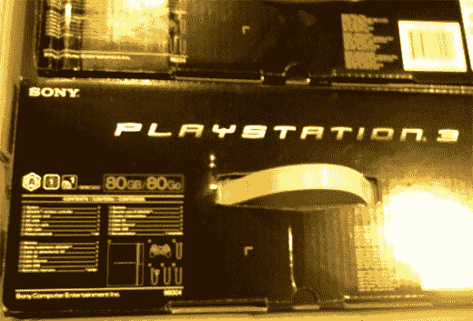

# 80GB PS3 是真的，我们敢在野外说吗？TechCrunch

> 原文：<https://web.archive.org/web/http://techcrunch.com/2007/04/25/80gb-ps3-is-for-real-dare-we-say-in-the-wild/>

# 80GB PS3 是真的，我们敢在野外说吗？

平息谣言，因为真相已经被揭露！这是一张 80GB Playstation 3“在野外”的谍照，正如他们所说。在你打电话给 Photoshop 和所有这些东西之前，读者应该注意到盒子里有一个新的设备型号:98004。随着 20GB PS3 被搁置，60GB PS3 成为目前唯一可用的版本，索尼为那些使用 PS3 进行多媒体的人做一个更强大的模型是有意义的。

还不知道它什么时候上市，但如果它已经被装箱，等等。我想是在夏末。

[野外 80GB PS3](https://web.archive.org/web/20130628192448/http://www.kotaku.com/gaming/playstation-3/ps3-80gb-already-in-the-wild-255036.php)【野外 Kotaku】