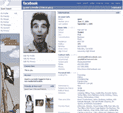

# 85%的大学生使用 FaceBook TechCrunch

> 原文：<https://web.archive.org/web/http://www.techcrunch.com:80/2005/09/07/85-of-college-students-use-facebook/>

 **公司:** [FaceBook](https://web.archive.org/web/20230210000057/http://www.crunchbase.com/company/facebook) 
**上线:**2004 年 2 月 4 日
**状态:**由[彼得·泰尔](https://web.archive.org/web/20230210000057/http://en.wikipedia.org/wiki/Peter_Thiel)和[Accel Partners](https://web.archive.org/web/20230210000057/http://www.accel.com/)
**员工:** 32 人在帕洛阿尔托，4 人在波斯顿
**地点:**帕洛阿尔托

## 概观

我一直对 FaceBook 感兴趣，这是一个非常受大学生欢迎的社交网站。

FaceBook 在天使轮中从彼得·泰尔筹集了约 50 万美元，2005 年 4 月从 Accel Partners 筹集了 1220 万美元(传言估值约为 1 亿美元)。

我已经阅读了描述一个充满活力和不断发展的社交网络的文章，但遗憾的是我根本无法进入它！要进入登录页面，您需要有效的。edu 学院/大学电子邮件地址，我不是大学生。

上周五，也就是 9 月 2 日，更多的消息出来了。FaceBook 开始允许高中生加入该网络，大大增加了他们的目标市场。

我周末给 FaceBook 发了邮件，请求采访。克里斯·休斯回信说他很乐意。我们今天谈过了。克里斯是一个很棒的人，他让我通过一个模拟账户访问了这个网站。我终于能够明白 FaceBook 是怎么回事了。顺便说一句，上面的截图是模拟账户简介。我认为克莱默的照片是个不错的选择。

这将是一个比正常帖子更长的帖子，因为我们大多数人都不能简单地尝试自己的服务。我已经把我的笔记组织在“成员”、“功能”和“商业模式”的主题下。

## 成员资格

要成为 facebook 的学院会员，你必须有一个 edu 学院/大学的电子邮件地址。大多数大学都会给学生发放这些。

脸书现在支持 882 所大学——如果算上社区大学，美国大约有 2000 所。他们的目标是随着时间的推移支持所有这些。

渗透率是惊人的——大约 85%受资助大学的学生在 FaceBook 上有个人资料。也就是 385 万会员。克里斯告诉我，60%的人每天都登录*。大约 85%的人每周至少登录一次，93%的人每月至少登录一次。*

 *随着高中数量的增加——在美国大约有 22，000 所，脸书的目标市场大幅增长。克里斯告诉我，自从上周五该功能推出以来，已经有“数万”名高中生加入了。

作为一名高中生成为一名成员是比较容易的。高中一般不发布电子邮件地址，所以没有一个积极的要求。edu 电子邮件帐户。目前的高中成员可以邀请其他人。一旦你开始上大学，你就有机会把账户转到你所就读的学校。

另外，Chris 告诉我，最近的校友(可以继续保持会员身份)保持着与当前会员相同的登录率。

## 功能

模拟账户简介可点击查看[。](https://web.archive.org/web/20230210000057/http://facebook.com/p.php?id=11752&l=732749925d)

除了基本的个人信息之外，我们还鼓励用户添加更多的描述性信息来建立自己的身份。用户可以添加喜欢的音乐、书籍、电影、语录等。每个条目都链接到搜索结果，用户可以在那里看到有相同兴趣的其他人。

用户还可以组建和/或加入群组。例子是政治和社会团体。不过 80%左右是“好玩”相关的，比如“我爱 NY”。

附加功能包括事件(聚会通知等)。)和消息(电子邮件)。

用户可以通过多种方式进行交互。可以加好友(必须互相接受)，也可以“戳”另一个成员，这是一种“你好”的表示方式。

这个网站最大的用途似乎是约会……你可以从我在 FaceBook 上找到的这个非常有趣的独立电影[中看到。它很长，但我强烈推荐它，如果你想感受一下服务的话。](https://web.archive.org/web/20230210000057/http://www.frostedworld.com/Facebook.mov)

## 商业模式

FaceBook 有三种创收方式。

*   当地文字广告(来自大学和当地企业)，每天 15-20 美元
*   在全国范围内销售的传统横幅广告
*   赞助团体——例子包括苹果、艺电等。

## 团队:

马克·扎克伯格——创始人兼首席执行官
肖恩·帕克——总裁
达斯汀·莫斯科维茨
安德鲁·麦科勒姆
克里斯·休斯*