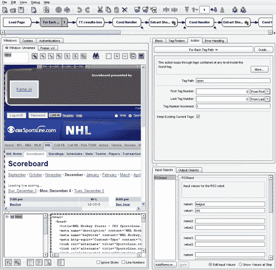

# OpenKapow:不太整洁

> 原文：<https://web.archive.org/web/http://techcrunch.com/2006/12/04/openkapow-not-quite-dapper/956040/>

# OpenKapow:不太整洁

今天， [Kapow Technologies](https://web.archive.org/web/20130628081037/http://kapowtech.com/) 推出了一个新的开发者社区， [OpenKapow](https://web.archive.org/web/20130628081037/http://openkapow.com/) ，它基于他们的 Kapow 网络爬行机器人。OpenKapow 允许任何人使用 Kapow 的 visual[IDE](https://web.archive.org/web/20130628081037/http://en.wikipedia.org/wiki/Integrated_development_environment)(Kapow robo suite)来更容易地编程和共享制作 RSS 提要、 [REST](https://web.archive.org/web/20130628081037/http://en.wikipedia.org/wiki/Representational_State_Transfer) 服务和 web 剪辑的机器人，它们可以作为各种混搭的主干。IDE 重 110MB，所以请耐心等待长时间下载。它不像 [Dapper](https://web.archive.org/web/20130628081037/http://www.techcrunch.com/2006/08/17/create-an-api-for-any-site-with-dapper/) 那样时尚，拥有虚拟浏览器和非技术界面，但却很好地介绍了 Kapow 成功的企业级服务。

该机器人的操作与任何其他自主开发的屏幕清理机器人非常相似，你可以快速编写程序来抓取 web 上的页面，但比仅依赖于基于匹配文本模式(正则表达式)抓取 html 代码的机器人更灵活，优化得更好。相反，Kapow 机器人在抓取和循环数据时会遵循站点的 DOM 结构。

IDE 的界面由三个主要部分组成:bot 的逻辑结构(用于循环和所有操作)、属性检查器和用于指导 bot 与网页交互的嵌入式浏览器。已完成的机器人程序的例子可以在社区论坛页面找到，所有已完成的机器人必须在那里发布，以便它们可以由 Kapow 的服务器运行。每个程序也可以被任何用户下载和修改。看看这个由一个成员的[节目](https://web.archive.org/web/20130628081037/http://service.openkapow.com/CBSSportslineScores.rss)创建的 [NFL 体育提要](https://web.archive.org/web/20130628081037/http://service.openkapow.com/CBSSportslineScores?league=nfl&rssVersion=0.91&channelName=&channelLink=&channelImageURL=&channelDescription=)。通过更多的编程，您可以基于 Kapow 数据创建更多有趣的混搭。

Kapow Technologies 于 1998 年在丹麦成立，他们的 bot 套件最初用于为欧洲最大的市场 Kapow 收集数据。2001 年，Kapow 决定重新专注于他们的软件。OpenKapow 标志着向更广泛的受众，特别是 mashup 人群展示 RoboSuite 的新努力。不过，和 Dapper 一样，我们还没有看到任何版权问题如何发展。

