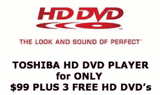

# 99 美元的 HD DVD 播放器

> 原文：<https://web.archive.org/web/http://techcrunch.com/2007/07/16/99-hd-dvd-player-not-so-much-99/>

经过一个周末的猜测，Engadget 终于揭开了 99 美元 HD DVD 播放器的神秘面纱，这款播放器将于本周在拉斯维加斯的家庭媒体博览会上亮相。这项交易最初看起来像是市场上的某种大规模 CE 转储，实际上只对与会者开放。这场演出的门票价格可以达到 500 美元左右，所以如果你真的喜欢 HD DVD，不要住在拉斯维加斯附近，你还不如在百思买买一个球员。

[东芝出售 99 美元的 HD DVD 播放器，附带一个条件](https://web.archive.org/web/20160320104332/http://www.engadget.com/2007/07/15/toshiba-selling-99-hd-dvd-player-with-a-catch/)【Engadget】
[东芝是在赠送剃须刀来让你买刀片吗？](https://web.archive.org/web/20160320104332/http://www.dvddossier.com/2007/07/a2-toshiba-hd-d.html)【DVD dos ier】