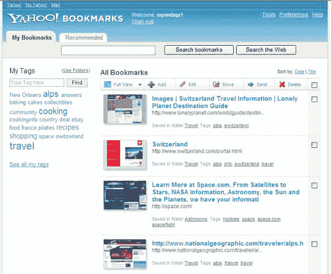

# 雅虎书签进入 21 世纪。TechCrunch

> 原文：<https://web.archive.org/web/http://techcrunch.com:80/2006/10/24/Yahoo!-bookmarks-enters-21st-century/>

今晚，雅虎将在 new.bookmarks.yahoo.com 发布一款全新的书签产品——新的界面，新的后端，等等。雅虎开发者 Tom Chi [制作的一个截屏展示在这里](https://web.archive.org/web/20150914125217/http://new.bookmarks.yahoo.com/welcome)，它很好地概述了这项服务(Chi 还为截屏制作了背景音乐)。将其与现有的书签产品进行比较([截图在此](https://web.archive.org/web/20150914125217/http://flickr.com/photos/michaelarrington/278756432/))，就可以清楚地看出这次革新有多么重大。

尽管大多数尖端网络用户看不到雅虎书签，但它仍声称拥有约 2000 万活跃用户(相比之下，del.icio.us 只有[100 万](https://web.archive.org/web/20150914125217/http://www.techcrunch.com/2006/09/25/delicious-reports-1-million-users-post-yahoo-growth-tops-all-of-digg/))。

直到今天，雅虎书签(这是一个独立于 [del.icio.us](https://web.archive.org/web/20150914125217/http://www.techcrunch.com/tag/del.icio.us) 和 [My Web](https://web.archive.org/web/20150914125217/http://www.techcrunch.com/2006/06/05/yahoos-my-web-relaunches-tonight/) 的产品)只存储特定书签的 URL、标题和评论。新产品缓存页面上的所有文本，存储缩略图视图，并允许对每个书签进行分类(文件夹)和标记。

新的书签产品还集成了新版的 Internet Explorer 的雅虎工具栏，允许一键添加书签。工具栏搜索栏上的搜索也会自动完成，以建议为该用户存储书签。

新产品已经被转移到与 My Web 相同的平台上，共享和其他一些功能暂时被删除(期待 del.icio.us 在不久的将来也转移到这个平台，同时保持其独特的外观和感觉)。

在今天的简报中，雅虎表示他们可能最终开始将用户书签直接整合到搜索结果中(他们已经以一种非常简单的方式整合了我的网络书签)。这可能会给像 [Wink](https://web.archive.org/web/20150914125217/http://www.techcrunch.com/tag/wink) 这样的新搜索初创公司带来竞争问题，这些公司已经将传统搜索结果与用户生成的书签结合在一起。

