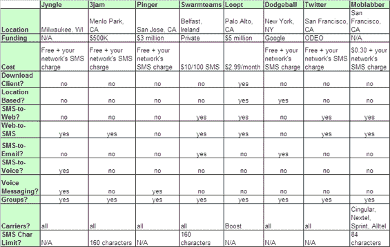

# 看看八种多人短信服务

> 原文：<https://web.archive.org/web/http://www.techcrunch.com:80/2006/09/27/a-look-at-eight-multi-person-sms-services/>

# 八种多人短信服务一览

在圣地亚哥举行的[演示](https://web.archive.org/web/20220716062404/http://demo.com/)会议即将结束，与 16 年前开始时不同的是，这次会议不是由手机发布主导的。然而，这里有一些非常有趣的移动服务，如 [ScanR](https://web.archive.org/web/20220716062404/http://scanr.com/) 和 [Realeyes3D](https://web.archive.org/web/20220716062404/http://realeyes3d.com/) 通过移动照片扫描图像， [Flurry](https://web.archive.org/web/20220716062404/http://flurry.com/) 在 Java 手机和 Grand Central 上的简单电子邮件和 RSS(我已经详细写过[关于](https://web.archive.org/web/20220716062404/https://beta.techcrunch.com/tag/grandcentral))。

[3Jam](https://web.archive.org/web/20220716062404/http://www.3jam.com/) 和 [Pinger](https://web.archive.org/web/20220716062404/http://www.pinger.com/) 都在 DEMO 上推出了多人短信服务。可能最早是由[躲避球](https://web.archive.org/web/20220716062404/http://www.dodgeball.com/)推广的，多人短信是一种功能(或一家公司——你说了算！)最近有不少人同时出柜。以下是对提供多人短信服务的八家公司的一些简短描述，以及显示哪些服务提供特定功能的表格。

**列表**

*   Jyngle 是一个基于网络的服务，有语音支持，刚刚推出，今天在 CrunchGear 得到了评论。
*   [3Jam](https://web.archive.org/web/20220716062404/http://www.3jam.com/) 得到了资助，相对来说比较简单，在演示会上推出。
*   Pinger 让用户通过语音快速回复信息，并在 2005 年从 Kleiner Perkins 获得了 300 万美元。
*   Swarmteams 做了很多事情，尽管我们无法让它在最初的评论的测试中很好地工作。你可能会有更好的运气，如果是这样，那么这个爱尔兰服务很值得使用。
*   Loopt 是一项由 YCombinator 和红杉投资的位置感知服务。我们[在发布](https://web.archive.org/web/20220716062404/http://www.beta.techcrunch.com/2006/09/11/loopt-to-make-mobile-presence-usable/)时回顾了它。
*   [躲避球](https://web.archive.org/web/20220716062404/http://dodgeball.com/)是老派，2005 年被谷歌收购。
*   [Twitter](https://web.archive.org/web/20220716062404/http://twitter.com/) 是为想要不同程度的即时、自动更新彼此活动的朋友们准备的。这是播客公司 [Odeo](https://web.archive.org/web/20220716062404/http://odeo.com/) 的产品。
*   Moblabber 是一个移动社交网络，用户可以自动接收来自它的热门消息。

毫无疑问，有更多的公司提供多人短信服务，或者至少在我点击发布这篇文章的时候会有更多的公司提供这种服务——但是我希望通过比较这七家公司的功能集来帮助我们对前景和我们今天所处的位置有一个清晰的认识。

