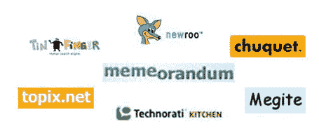

# Memeorandum 猎人

> 原文：<https://web.archive.org/web/http://www.techcrunch.com:80/2006/02/04/a-look-at-the-memeorandum-killers/>

我今天已经写了两个新的实时新闻聚合器，分别是 [Megite](https://web.archive.org/web/20220707182528/http://www.beta.techcrunch.com/2006/02/03/is-megite-a-contender/) 和 [Newroo](https://web.archive.org/web/20220707182528/http://www.beta.techcrunch.com/2006/02/03/newroos-real-time-news-aggregator/) 。

这个领域显然很热，有资金支持和没有资金支持的公司都争相发布产品。目标？利用所有优秀的 edge 博客内容，通过分析谁在链接谁(以及其他工具)，找出任何给定时间的热门内容，并将热门内容呈现给用户。

这个空间不好定义。总的来说，我认为主要关注博客链接的服务提供了最好的东西。Paul Montgomery 在本周早些时候的一篇文章中列出的许多服务都没有这样做…它们依靠用户投票或其他算法来确定相关性。

我的清单在下面。这些网站或者使用引入链接或者故事集群(或者两者都使用)来确定相关性，并且显示链接/讨论博客。我已经分别写了许多关于这些的文章。其他的我会在将来写，如果他们的特征有趣的话。

列表:

1.  [博客科学](https://web.archive.org/web/20220707182528/http://www.blogniscient.com/)
2.  [Blogrunner](https://web.archive.org/web/20220707182528/http://annotatedtimes.blogrunner.com/)
3.  [Blogsnow](https://web.archive.org/web/20220707182528/http://www.blogsnow.com/)
4.  [丘凯](https://web.archive.org/web/20220707182528/http://www.chuquet.com/)
5.  [Megite](https://web.archive.org/web/20220707182528/http://www.megite.com/)
6.  [记忆随机](https://web.archive.org/web/20220707182528/http://tech.memeorandum.com/)
7.  [Newroo](https://web.archive.org/web/20220707182528/http://www.newroo.com/) (预发布)
8.  [尾秩](https://web.archive.org/web/20220707182528/http://www.tailrank.com/)
9.  [Technorati 厨房](https://web.archive.org/web/20220707182528/http://kitchen.technorati.com/explore/)
10.  [小拇指](https://web.archive.org/web/20220707182528/http://www.tinfinger.com/)(预投放)
11.  [Topix.net](https://web.archive.org/web/20220707182528/http://www.topix.net/blogs)
12.  [真理熊](https://web.archive.org/web/20220707182528/http://www.truthlaidbear.com/topics.php)

最好的？仍然是 Memeorandum，但我喜欢其他服务正在尝试的实验。

此外:这些服务将开始被大公司收购，哪怕只是为了引擎背后的工程技术。

**更新:**关于 Memeorandum 和这个空间的更多信息，[请听昨天的吉尔摩帮](https://web.archive.org/web/20220707182528/http://gillmorgang.podshow.com/?p=30)，他们有一位嘉宾 Gabe。