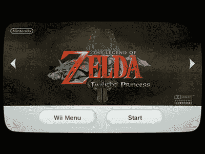
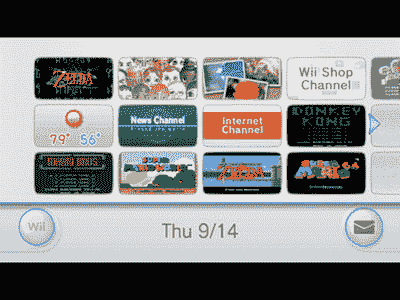
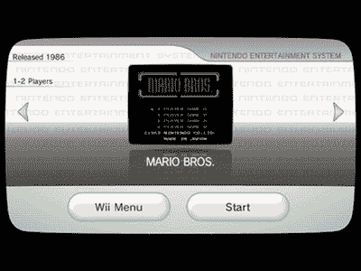
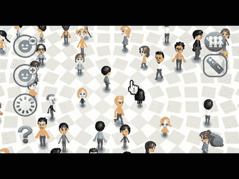
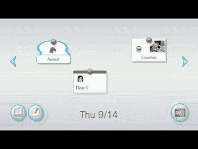
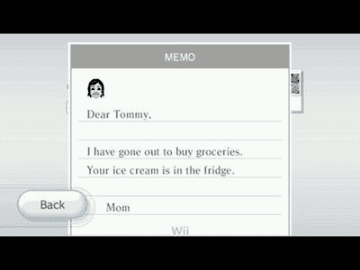
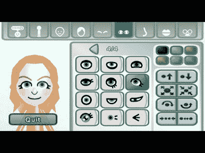

# Wii 界面一览

> 原文：<https://web.archive.org/web/http://techcrunch.com/2006/10/02/a-look-at-the-wii-interface/>

终于，我们可以看到 Wii 的英文界面了！雅虎英国拿到了一些 Wii 界面的图片，它们不会让人失望。该界面提供了许多微软为 Xbox 360 用户提供的相同功能，包括一个可以下载内容的“Wii 商店”频道。原创 NES 游戏作为下载内容？！希望如此！

显示的其他频道包括新闻、天气和图像管理。为什么你会想知道外面发生了什么，而你却带着一个全新的 Wii 在里面，这让我很困惑。开个玩笑(不尽然)。其他图片显示了 Wii 的一些消息功能，也显示了 Mii 头像的创建。Mii creator 让你从一堆预设功能中定制一个小头像，让~~小时的无尽~~头像乐趣成为可能。看看跳跃后的界面图片！

[Wii 接口](https://web.archive.org/web/20160316031941/http://www.kotaku.com/gaming/nintendo/new-wii-channels-pics-204426.php)【kotaku】