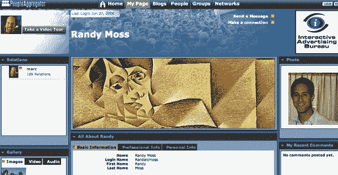

# 深入了解 people aggregator TechCrunch

> 原文：<https://web.archive.org/web/http://www.techcrunch.com:80/2006/06/27/a-look-inside-peopleaggregator/>

# 深入了解 PeopleAggregator

 Marc Canter 备受期待的 [PeopleAggregator](https://web.archive.org/web/20230220135052/http://www.peopleaggregator.com/) 开始推出，密码保护定于太平洋时间周三中午左右取消。PeopleAggregator 是 Canter 三年自筹资金工作的产物，旨在弥合所有可用的在线社交网络服务之间的差距，并将行业推向基于标准的协作场所。我今天查看了系统内部，并和坎特通了电话。在今天之前，我不认为这很重要，但现在我相信了。

坎特是 20 世纪 80 年代一家名为 Macromedia 的公司的创始人。Macromedia 后来成为 Macromedia，坎特表示，他今天正在为自己将用户锁定在 Macromedia Flash 上的行为付出代价。PeopleAggregator 的宗旨是使用开放标准来防止锁定新网络最重要的领域之一——在线社交网络。

它是这样工作的。PeopleAggregator.net 本身将是一个功能齐全的在线社交网络，但它将通过我们个人资料的通用身份标准以及我们的写作、多媒体和联系人的 API(应用编程接口)与其他服务共享信息。

也许最重要的是，PeopleAggregator 还将为新的社交网络提供托管软件，下个月晚些时候将为那些喜欢自己托管软件的组织提供软件下载。非营利组织将免费获得许可证，而商业企业在成功实现系统货币化后将一次性支付一笔费用。

这意味着进出新的社交网络将变得容易，而不是仅仅因为你花了时间和精力使用你的账户就被锁定在一个社交网络上。如果坎特的愿景成功，那么无数的社交网络将会以独特的风格和功能，但具有互操作性，而不是受一个集中式数据库和服务的支配。

您目前可以使用 LiveJournal 或 Flickr ID 登录 PeopleAggregator，并自动交叉发布到 LiveJournal、Xanga 和任何其他使用 Blogger、Atom 或 Metaweblogs APIs 的系统。微软最近宣布将其新的开放身份标准 CardSpace 重命名，这将是 PeopleAggregator 支持的众多身份标准之一。坎特预计 AOL、雅虎和 Beebo 将很快加入进来——MySpace 将是最难的一个，他说。

坎特说，他已经有了按项目类型解析 RSS 的大计划，包括对朋友的访问控制等等。该网站已经有了一个不错的结构化博客用户界面，这是我从未想过会感兴趣的东西。使用图形界面，链接到标记新内容的表单，如博客帖子、事件列表、产品评论等。在 PeopleAggregator 中是如此简单，以至于我可以想象自己和其他人愉快地使用它。

我喜欢测试 PeopleAggregator，它有一些 bug，足够稳定，但最令人兴奋的是，我对它的界面、文化或规则的任何问题都不是大问题——我可以把我的身份、博客帖子和图片带到另一个支持开放标准的社交网络，我更喜欢它。这是用户的力量。

我定期与创建新社交网络的人交谈。我总是问他们是否支持开放身份标准。我接触过的其他创业公司都不是。有一种方法可以做到这一点，从而通过信任而不是锁定来赢得忠实用户。
