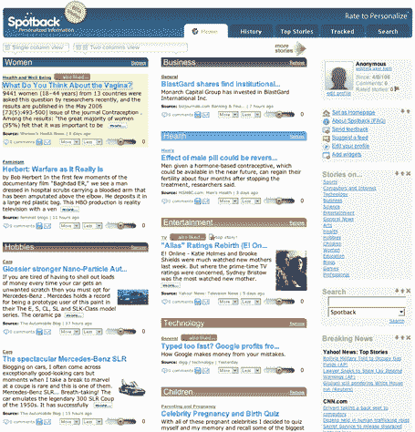

# 个性化新闻的新观点 TechCrunch

> 原文：<https://web.archive.org/web/http://www.techcrunch.com:80/2006/05/01/a-new-look-at-personalized-news/>

# 个性化新闻的新视点

  以色列初创公司 [Spotback](https://web.archive.org/web/20230210060214/http://www.spotback.com/) ，我已经跟踪了一段时间的，将于今晚(周一)太平洋时间晚上 10 点推出。Spotback 是一个个性化的新闻门户网站，它可以随着时间的推移从用户行为中学习，以提供适合他们的新闻。

Web 2.0 新闻网站通常分为两类。像 [Digg](https://web.archive.org/web/20230210060214/https://techcrunch.com/2006/03/18/the-power-of-digg/) 和 [Newsvine](https://web.archive.org/web/20230210060214/https://techcrunch.com/tag/Newsvine/) 这样的网站利用用户的反馈和行动来影响整个社区的看法。像 [Findory](https://web.archive.org/web/20230210060214/https://techcrunch.com/tag/findory/) 这样的个性化网站会根据一段时间内用户的行为改变呈现给用户的内容。Spotback 属于后一种类型——一个个性化的新闻网站，根据每个用户喜欢和不喜欢的内容而随时变化(尽管他们也有一个 Top Stories 标签，上面有所有用户评价最高的新闻)。

spot back 上的每条新闻都可以被用户评价、保存和/或通过电子邮件发送给他人(点击右边的图片查看大图)。用户可以评论任何故事。还可以标记新闻条目的来源，告诉 Spotback 包含更多类似的新闻，或者阻止类似的条目(或来自该来源的)。最后，用户还可以定制页面，以包含他们喜欢的任何新闻类别(商业、体育等)。)或 RSS 阅读器小部件，它允许用户添加任何可能尚未包含在 Spotback 索引中的新闻源。

这是我最喜欢 Spotback 的地方——不需要设置用户账户，如果你愿意，你可以直接访问这个网站(通过 cookie 个性化)。如果你真的创建了一个用户账户，你可以根据其他用户的喜好来给他们评分，并接收个性化的新闻。

