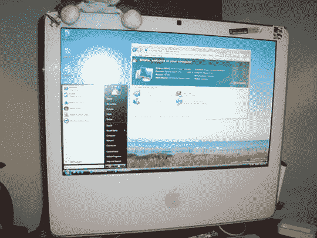

# 一个愚蠢、疯狂的 Mac 谣言我们从这里开始:新 Mac 将搭载 Vista——TechCrunch

> 原文：<https://web.archive.org/web/http://techcrunch.com:80/2007/05/31/a-stupid-insane-mac-rumor-were-starting-right-here-new-macs-to-ship-with-vista/>

# 一个愚蠢、疯狂的 Mac 谣言我们从这里开始:新的 Mac 电脑将搭载 Vista

**【更新，05-31-07，下午 2:37 PST】**所以我和其他一些著名的博客作者在讨论这个不太可能的谣言，我们开始意识到一些事情:随着 Vista 的核心元素在英特尔硬件上就位，想象一下 [OS X](https://web.archive.org/web/20201127031911/https://crunchbase.com/product/os-x) 运行 Windows 应用程序将不是一件很难的事情。然后，一个偶然的机会，我在《苹果每日新闻》上看到了这篇文章,文章提出了这个想法，这可能就是史蒂夫为 WWDC 保守秘密的方式。Bootcamp 2 不在 Leopard 的当前预览版中，也不在许多其他预期的玩具中。我们仍然认为整件事有点可疑，但这创造了多大的可能性，不是吗？

* * *

这可能是我们听过的最疯狂的苹果谣言，也最有可能是废话。但是为了增加网站流量，为了获得“第一”的吹嘘权如果这是真的，因为我们太鲁莽了，我们现在就把它带给你。

在华尔街日报的 D 会议上，我们值得信赖的可靠消息来源为我们提供了所有的[Foleo good](https://web.archive.org/web/20201127031911/http://crunchgear.com/2007/05/30/scoop-new-palm-device-is-foleo-dont-call-it-a-laptop/)在昨天的 [Steve 的聊天中，我们与其他一些为苹果工作的公关人员聊天。他/她说，他们对乔布斯在 WWDC 正式发布前两周意外泄露《豹》的秘密感到紧张。消息人士开玩笑地说，这实际上是 Vista 的重新设计版本，令他们惊讶的是，公关人员说，“不，Vista 本身在新 MAC 上运行得很好，Bootcamp 2 让我们将其作为双启动的附加选项。”或者类似的东西。](https://web.archive.org/web/20201127031911/http://crunchgear.com/2007/05/30/youtube-on-apple-tv-officialized/)

我们认为苹果公司的公关人员在扰乱我们的消息来源，我们的想法是把想法挂在旗杆上，看看它们是否能飞起来。我们真的看不到任何 MAC 电脑会很快推出双启动 Windows 系统，但史蒂夫以前给过我们惊喜，所以谁知道呢？我们将可能性标记为非常低，但更奇怪的事情已经发生了。苹果公关先生/女士，谢谢你在新闻缓慢的一天给我一些东西来发表！