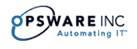

# Web 1.0 成功案例:惠普以 16 亿美元收购 op sware 

> 原文：<https://web.archive.org/web/http://www.techcrunch.com:80/2007/07/23/a-web-10-success-story-hp-acquires-opsware-for-16-billion/>

# Web 1.0 成功案例:惠普以 16 亿美元收购 Opsware

 惠普以 16 亿美元收购了 IT 自动化公司 [Opsware](https://web.archive.org/web/20230131034116/http://opsware.com/) 。

虽然这种规模的收购本身就很有趣，但 Opsware 的背景故事更是如此；Opsware 最初名为 LoudCloud，是一家 Web 1.0 公司，在 Web 1.0 热潮期间获得了 3.5 亿美元的融资。马克·安德森[解释故事](https://web.archive.org/web/20230131034116/http://blog.pmarca.com/2007/07/hp-buys-my-comp.html):

> 1999 年 9 月，在网络繁荣的高峰期，我和一小群同事创办了一家新公司 Loudcloud，他们的想法是，当时初创公司和大公司正在进行的巨大的互联网基础设施建设需要一种新的方法来大规模运行现代数据中心和计算机系统:自动化。
> 
> Loudcloud 像火箭一样起飞，通过股权和债务融资筹集了 3.5 亿美元，于 2001 年 3 月上市，当整个市场崩溃，几乎所有的竞争对手和同行都破产时，它的年度经常性管理服务收入迅速接近 1 亿美元。
> 
> 2002 年 9 月，我们作为一家上市公司进行了彻底的重新开始——我们将托管服务业务出售给 EDS，并将 Loudcloud 转变为 Opsware，一家基于 Loudcloud 开发的核心知识产权的软件公司。在接下来的五年中，我们在这一新模式中实现了我们最初的愿景——大规模现代数据中心和计算机系统的自动化，并构建了一个全面的先进自动化软件产品系列，为现代数据中心中的所有技术提供支持，从服务器和应用程序到网络和存储。

Opsware 的客户包括高盛、摩根大通、家得宝、通用电气、微软、三星、康卡斯特、Tivo 和美国国防部。这家总部位于桑尼维尔的公司拥有 550 名员工，年收入 1 亿美元。