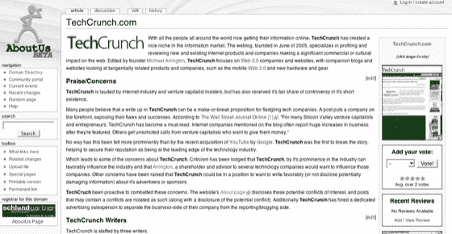

# 关于我们:一个关于每个网站的 Wiki 

> 原文：<https://web.archive.org/web/http://www.techcrunch.com:80/2006/11/14/aboutusorg-a-wiki-about-every-website/>

# 关于我们:一个关于每个网站的维基

  总部位于俄勒冈州波特兰市的 [AboutUs](https://web.archive.org/web/20220927233427/http://www.aboutus.org/) [本周](https://web.archive.org/web/20220927233427/http://www.bizjournals.com/portland/stories/2006/11/13/story2.html?page=1&b=1163394000%5E1374690)宣布已完成 A 轮融资，融资 100 万美元。该网站是一个网站的维基目录，大部分是自动填充的，但有相当大的流量，每天都有越来越多的编辑。如果你在 AboutUs 上查找你的网站，你可能会在那里找到一个条目。我想大多数不是维基爱好者的人会认为这是一个奇怪的行业，在某种程度上我也这样认为。它也很有趣，背后有一些好人。

共有 16 名投资者参与了这轮投资，Capybara Ventures 和 Northwest Technology Venture 提供了机构支持。AboutUs 创始人雷·金(Ray King)是 SnapNames 的联合创始人兼首席执行官。AboutUs 的顾问委员会包括维基创始人沃德·坎宁安、奋进资本公司的斯蒂芬·巴布森和 Edgeio 公司的基思·特雷。AboutUs 网站于 8 月份上线，并见证了健康的流量增长。仅仅几个月后网站的流量就是它的主要卖点之一。

AboutUs 建立在 MediaWiki 之上，与维基百科运行的平台相同。这不是世界上最漂亮的东西，但它很实用。维基中有大约 300 万个网站的条目。绝大多数都来自 Whois 记录，每个页面都有相关链接和谷歌地图。5 人公司每天晚上亲自检查所有的编辑，现在平均在一千到两千之间。(创始人雷·金说，加上“我真的能改变这一切吗？”是人们对网站进行的最常见的编辑。)没有中立观点的要求，但是鼓励将评论类型的文本放在评论的特殊部分。

有 300 万个关于网站的页面让我感到困扰，这些页面是自动填充的，由任何路过的随机编辑编辑，标题是“关于我们”这个短语暗示了一个自传文本。(也很可能对 SEO 很有好处。)TechCrunch 上的 AboutUs 页面不是由任何与 TechCrunch 有关联的人写的，AboutUs 这个名字让我感到不舒服。我当然可以进去修改条目，但这更像是我必须做的事情，除非我忽略它。

该公司与一些域名注册商合作，将每个网站的 AboutUs 页面的链接放在 WhoIs 信息的顶部，以换取一个链接回该注册商的徽章。金希望越来越多的网站将链接到他们的 AboutUs.org 网页上，因为他打算尽可能在网上的每个网站上添加维基功能和一个关于页面编辑的社区。

该网站尚未盈利；雷·金表示，他们将探索付费功能，比如在公司网页上发布付费工作列表。我无情地探寻 King 中反社会利润驱动的一些迹象，因为我花了一段时间才相信，基于从其他网站的 WhoIs 记录中抓取的内容的业务可能是合法的。但最终，我确信金确实是“维基方式”的忠实信徒，他称之为基于诚信假设的合作文化。

撇开诚信假设不谈，我希望至少有一个 RSS 订阅源来订阅我所连接的网站的变化。King 说这是一个优先考虑的问题，并且很快将成为他对 MediaWiki 实现的一系列扩展之一。

AboutUs 能成功吗？如果是的话，这将是网络文化大转变的一部分。我喜欢在维基上发布网站指南的想法，尽管称之为 AboutUs 让我不舒服，我希望一波令人讨厌的编辑不会让我后悔指向它。如果维基纯洁的快乐媒介和对编辑的一些控制能够被维持，AboutUs 可能在一个仍然决定它对“维基方式”感觉如何的世界中处于有利地位。

