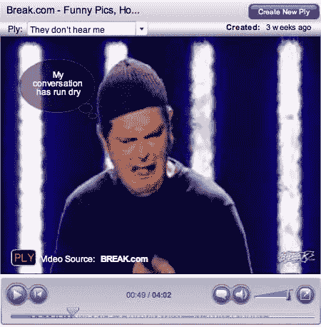

# 向视频添加文本气泡 TechCrunch

> 原文：<https://web.archive.org/web/http://www.techcrunch.com:80/2006/12/10/add-text-bubbles-to-videos/>

# 给视频添加文本气泡

  全新的以色列创业公司 [BubblePLY](https://web.archive.org/web/20221203090746/http://www.bubbleply.com/) 创造了一个简单的工具，可以在热门视频分享网站的视频中添加文字或链接漫画风格的泡泡。告诉它 YouTube、Google Video、Metacafe 和 [others](https://web.archive.org/web/20221203090746/http://www.plymedia.com/qa/more.aspx) 上某个视频的链接，然后添加自己的内容。视频被保存，并可以通过链接或嵌入网页来共享。看演示[这里](https://web.archive.org/web/20221203090746/http://www.bubbleply.com/demo.aspx)，一个例子是[这里](https://web.archive.org/web/20221203090746/http://www.bubbleply.com:80/player.aspx?pid=c7724043-39ad-4770-bc32-2ec46b54b315)(现在嵌入好像有点问题)。

这对我来说是太多的工作了，但我猜一些 MySpacers 用户会觉得这很有吸引力。

