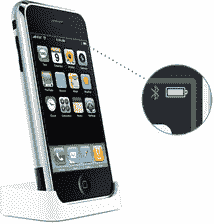

# 将您自己的铃声添加到 iPhone | TechCrunch

> 原文：<https://web.archive.org/web/http://techcrunch.com:80/2007/07/13/add-your-own-ringtone-to-the-iphone/>

# 将您自己的铃声添加到 iPhone

虽然这一功能应该很快就会出现在某种很酷的开源 UI 包中，但 HacktheiPhone 的人已经将这个过程分成了 23 个易于遵循的步骤，包括下载 iPhone restore 文件，删除它们，将你自己的铃声放入一个文件夹，然后上传。我要放上我妈妈告诉我我有多好的 MP3。然后我要去看 iPhone 而不是去退休中心看她。iPhone 理解我。

[如何添加自定义铃声(目前仅适用于英特尔 Mac 用户)](https://web.archive.org/web/20130628204750/http://www.hacktheiphone.com/iphone_ringtone_installation.html)【黑客电话】