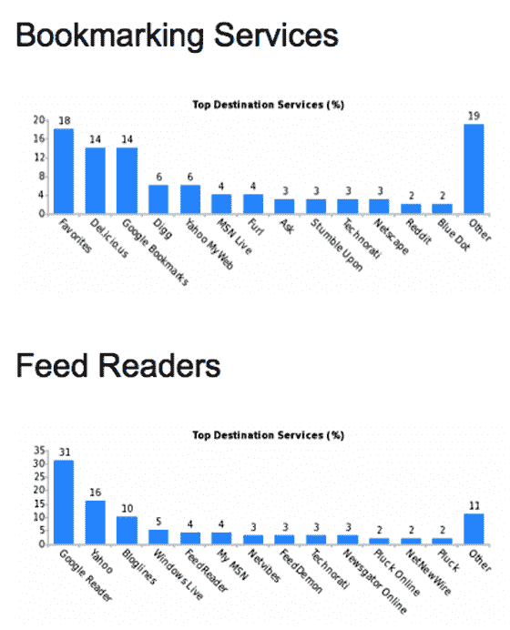

# 添加收集大量有趣数据的小部件 

> 原文：<https://web.archive.org/web/http://www.techcrunch.com:80/2007/03/05/addthis-widget-gathering-lots-of-interesting-data/>

# 添加这个收集大量有趣数据的小部件

  你可能在网上冲浪的某个时候在博客上见过[添加这个](https://web.archive.org/web/20230106021517/http://www.addthis.com/)按钮。这是一个简单、免费的小部件，博客所有者可以添加到他们的网站上，在博客文章的结尾显示许多书签选项(还有一个 feed reader 小部件，用于简单的 RSS 订阅)。读者只需轻轻一点，就可以在 Digg、Del.icio.us、Stumbleupon、Google Bookmarks、Bluedot 和其他服务上为帖子添加书签。例如，我们在这篇文章的末尾添加了一个 AddThis 按钮。

这项服务于 2006 年 10 月推出，并宣布上个月每天有超过 100 万次的点击量。明天他们将宣布他们已经达到了 200 万的里程碑。

如果您有兴趣将 AddThis 小部件添加到您的站点，定制工具[在这里](https://web.archive.org/web/20230106021517/http://www.addthis.com/web-button-select.html)。

AddThis 正在收集一些非常有趣的数据，这些数据可以形成商业模式的核心，因为它们已经有了相当深入的渗透。他们明天将发布一些数据——展示顶级书签服务和用户存储数据的 feed 阅读器(见下图)。鉴于 AddThis 还可以看到人们正在标记的故事，不难想象他们可以利用所有这些数据做其他事情。

排在浏览器功能本身(“收藏夹”)之后的顶级书签服务是 del.icio.us 和谷歌书签，其次是 Digg 和雅虎 My Web。没什么好惊讶的。最受欢迎的阅读器是经过大幅改进的谷歌阅读器，比雅虎和博客网站加起来还要受欢迎。我对此感到惊讶——[最近的 Feedburner 数据](https://web.archive.org/web/20230106021517/http://techcrunch.com/2007/02/22/feedburner-releases-major-user-engagement-report/)显示 Google Reader 做得很好，但没有数据显示的那么好。

