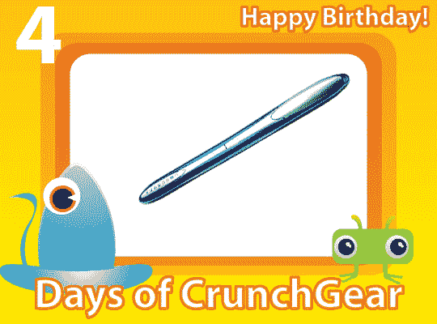

# AdMob four iPhone:你会真正喜欢的移动广告

> 原文：<https://web.archive.org/web/http://techcrunch.com:80/2007/08/13/admob-four-iphone-mobile-ads-youll-actually-like/>

 [https://web.archive.org/web/20150919105022if_/http://www.youtube.com/embed/TFMW2-wR7aw?version=3&rel=1&fs=1&showsearch=0&showinfo=1&iv_load_policy=1&wmode=transparent](https://web.archive.org/web/20150919105022if_/http://www.youtube.com/embed/TFMW2-wR7aw?version=3&rel=1&fs=1&showsearch=0&showinfo=1&iv_load_policy=1&wmode=transparent)

视频

这有点过时，但是很酷。AdMob 刚刚为 iPhone 推出了一种新型的移动广告，它利用 CSS 和其他 Ajax-y 技术来提供个性化广告。上面的视频展示了广告是如何运作的。它们不会把你带到一个单独的页面，而是会弹出一个快速的谷歌地图或弹出窗口，给你提供特定地点和时间的信息。

这些广告是 iPhone 专用的，只会在 iPhone 上显示。包括星巴克在内的 15 家公司已经签约。很快，你就可以在阅读《纽约时报》的同时搜索巨无霸了。科技不是很伟大吗？

嘿，对了……笔扫描仪粉丝:想要笔扫描仪？DocuPen RC800 怎么样，这是一款独特的笔扫描仪，专为学生、律师和通常会从图书馆的书中翻出东西的古怪家伙而设计。现在你所要做的就是将 DocuPen 滑过一段文字，然后上传到你的 PEE CEE。快速，花哨，超级滑头。你如何能得到一个？

给 contest@crunchgear.com 发一封电子邮件，主题是“把它写出来”